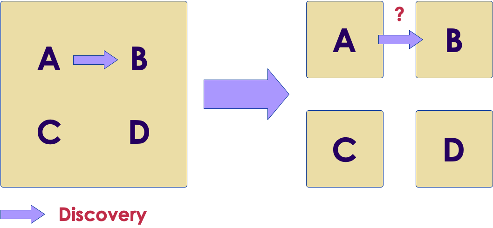
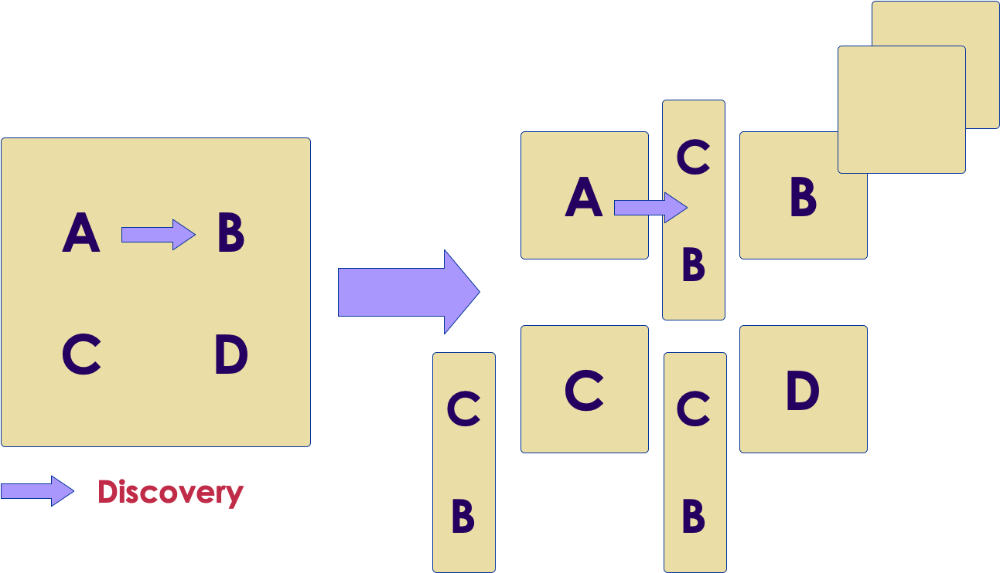
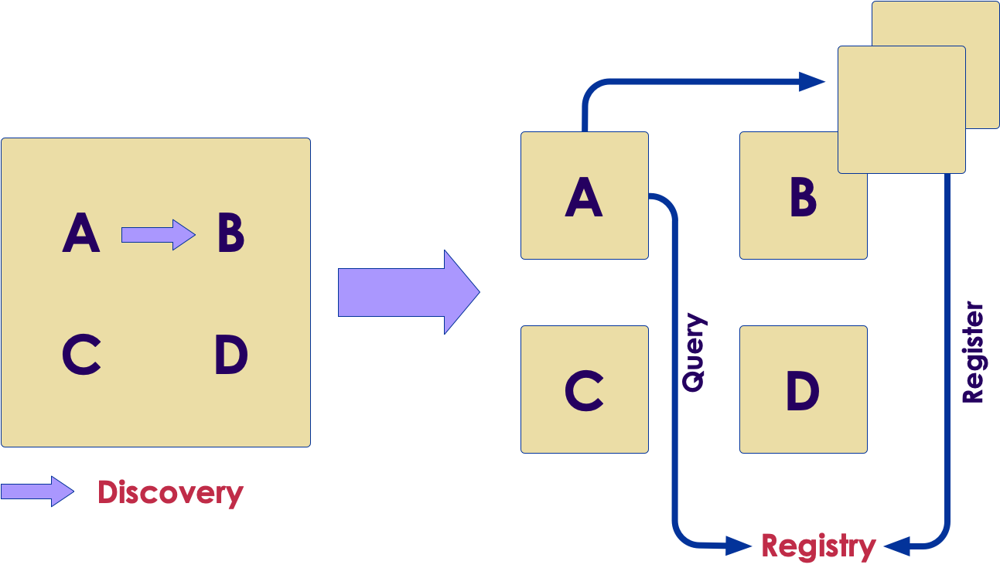
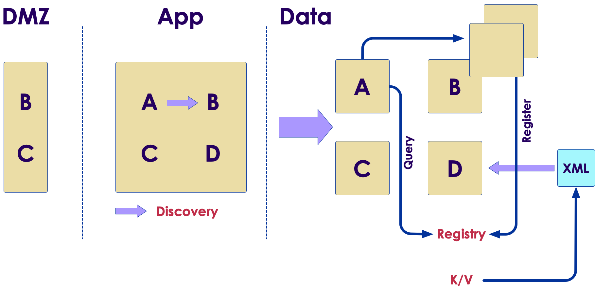
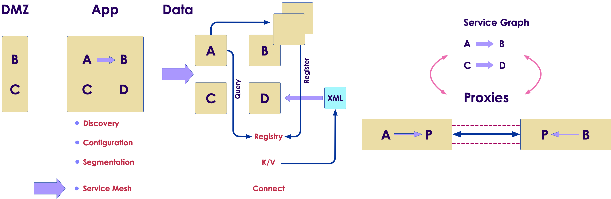
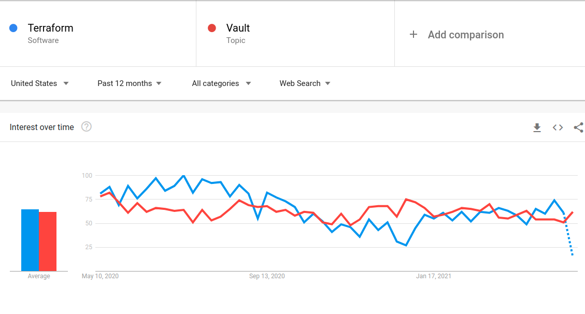

# Consul
---

# Consul overview
---

## Monolith

<!-- {"left" : 2.85, "top" : 2.26, "height" : 4.56, "width" : 4.56} -->

Notes: 

A - login
B - Show balance
C - Wire transfers
D - Foreign exchange

A bug causes a rebuild and redeploy

---

## Microservices

<!-- {"left" : 0.9, "top" : 2.93, "height" : 3.21, "width" : 8.44} -->

---

## Discovery

<!-- {"left" : 1.27, "top" : 3.04, "height" : 3.57, "width" : 7.71} -->


Notes:

A talks to B in nanoseconds
Now where is B and milliseconds or seconds for latency

---

## Load balancers?

<!-- {"left" : 1.02, "top" : 2.18, "height" : 4.71, "width" : 8.21} -->


Notes:

* Load balancers
* Even scalability  
* Too many load balancers
* Too many SPOFs
* Double latency
* Load balancing management
---

## Registry


<!-- {"left" : 1.02, "top" : 2.2, "height" : 4.67, "width" : 8.21} -->


Notes:

* No load balancers
* The instance registers

---


## Configuration


<!-- {"left" : 1.02, "top" : 2.12, "height" : 4.83, "width" : 8.21} -->

Notes:

* Before, one configuration file XML, now - many
* Such as, are we in maintenance mode


---


## Configuration in Consul


<!-- {"left" : 1.02, "top" : 2.09, "height" : 4.9, "width" : 8.21} -->


Notes:

* Stored as K/V
* Pushed to components in real time


---


## Zones

<!-- {"left" : 1.02, "top" : 2.82, "height" : 4, "width" : 8.21} -->

Notes:

* Zones were easy
* Three tiers
* Now we have multiple front doors and communications
* How do we communicate


---

## Segmentation

<!-- {"left" : 1.02, "top" : 2.52, "height" : 4.61, "width" : 8.21} -->

Notes:

* Segmentation is done with "Connect" in Consul


---

## Service graph

<!-- {"left" : 3.51, "top" : 2.56, "height" : 4.52, "width" : 3.23} -->


Notes:

* We were not talking IP to IP
* Now we are!
* In firewall rules translation, the rules scale dependent on the number of servers

---


## Identity

<!-- {"left" : 1.52, "top" : 2.47, "height" : 4.71, "width" : 7.2} -->

Notes:

* How do we assert identity?
* How do we know A is A and B is B
* Issue TLS certs to authenticate A and B
* This is better than IP that gives now guarantees
* But how do we enforce this?

---

## Proxies

<!-- {"left" : 1.44, "top" : 3.61, "height" : 1.84, "width" : 7.37} -->


Notes:

* This translates into a set of proxies
* A talks to proxy transparently, unaware than anything has changes
* The proxies are using certificate authority: A will verify that it is talking
to B and B will verify that it is talking to A
* Second advantage of using Mutual TLS is that now you have established an ecrypted channel between them
* This is getting more important in light of such regulations ad GDPR
* We cannot trust traffic within our own network. The data is now encrypted both at rest and in transit
* A can talk to be and vice versa, but should A be talking tobe at all? This goes back
to the service graph and asks if A is allowed to talk to B
  

---

## Proxies and Service Graph


<!-- {"left" : 1.02, "top" : 2.31, "height" : 4.44, "width" : 8.21} -->

Notes:

* A can talk to be and vice versa, but should A be talking tobe at all? This goes back
  to the service graph and asks if A is allowed to talk to B

---

## Service mesh

<!-- {"left" : 0.69, "top" : 3.09, "height" : 2.89, "width" : 8.87} -->


Notes:
* We improved the programmer's efficiency
* But we got three operational problems
* Together they are called Service Mesh - and that is was Consul is set up to address

---

## Lab: Consul install

* Please do lab 'lab31'
* [https://github.com/elephantscale/vault-consul-labs-answers/tree/main/lab31](https://github.com/elephantscale/vault-consul-labs-answers/tree/main/lab31)

---

# Microservices
---

## Microservices - insert the microservices slides here

---

# Consul for Service Discovery
---

## Why service discovery?

* Applications are running on dynamic infrastructure
* Need to determine services are running and how they can be accessed
* HashiCorp provides a solution, and it is Consul
* How?
  * applications and services register with Consul
  * service registry is populated
  * connect to critical services throughout the organization

Notes:

In a fast-moving business where applications are running on dynamic infrastructure,
determining where services are running and how they can be accessed may become a
challenge to manage. Fortunately, HashiCorp provides a solution to this dilemma with its
Consul product. By instructing applications and services to register with Consul, a service
registry can be populated, and applications can query the registry to discover and connect
to critical services throughout the organization.

---

## Consul vs Zookeeper

<!-- {"left" : 1.29, "top" : 2.22, "height" : 5.19, "width" : 7.67} -->


---

## Consul vs Google Anthos


<!-- {"left" : 1.02, "top" : 2.32, "height" : 4.43, "width" : 8.21} -->

---


## Consul is from HashiCorp 

* Consul is a solution provided by HashiCorp
* tight integration with Consul to simplifies access to Vault
* Users and applications can query Consul using either DNS or the API
* Consul responds to the query with the information needed to establish communication with the active Vault node
* Faster and smarter than a load balancer

Notes:

Since Consul is a solution provided by HashiCorp, it should come as no surprise that
HashiCorp Vault includes tight integration with Consul to simplify access to Vault. Users and
applications can query Consul using either DNS or the API when communication to Vault is
required. Consul responds to the query with the information needed to establish
communication with the active Vault node. If the Vault environment changes, Consul is
immediately aware of those changes and begins directing subsequent requests to the now-
active Vault environment. This strategy can help organizations reduce or eliminate the
reliance on a front-end load balancer that may not reflect changes fast enough when using
a health check configured with timeouts and thresholds.

---

## Consul and Vault cluster

* Consul can also simplify the connectivity to standby nodes within the cluster
* Especially when running Vault Enterprise with performance standby nodes
* Performance standby nodes can service Vault read operations and help
  Vault operators scale those read operations within a cluster
  
Notes:

In addition to maintaining a connection to the active node, Consul can also simplify the
connectivity to standby nodes within the cluster. This connectivity may be especially
convenient when running Vault Enterprise with performance standby nodes. As previously
discussed, these performance standby nodes can service Vault read operations and help
Vault operators scale those read operations within a cluster. By using Consul to
communicate with the performance standby nodes, clients a

---

## Registering the Vault Service with Consul

* When you deploy a Vault cluster with Consul backend -
  * Vault service is automatically registered with the Consul service registry by default
* Best practice
  * If Consul service discovery is desired, a second Consul cluster should be deployed to manage this functionality
  
Notes:

When a Vault cluster is deployed using a Consul storage backend, the Vault service is
automatically registered with the Consul service registry by default. However, HashiCorp
recommends that the Consul cluster deployed as the storage backend never be used for
additional Consul functionality, such as service discovery. This recommendation ensures
the Consul cluster can dedicate all available resources to servicing the storage backend
rather than other Consul functions. If Consul service discovery is desired, a second Consul
cluster should be deployed to manage this functionality.

---

## How to register

* The _service_registration_ stanza is added to the Vault configuration
* This configuration includes 
    * the address and port of the Consul cluster
    * the Consul ACL token to permit Consul access (if Consul ACLs are
  enabled)
    * other configurable parameters such as service_tags.

Notes:

The service_registration stanza needs to be added to the Vault configuration file to register
the Vault service with a Consul cluster. 

---

## service_registration stanza example


<!-- {"left" : 0.29, "top" : 1.97, "height" : 2.1, "width" : 9.67} -->

Notes:

This configuration includes the address and port of
the Consul cluster, the Consul ACL token to permit Consul access (if Consul ACLs are
enabled), and other configurable parameters such as service_tags. Keep in mind that
the token is a Consul ACL token, not a Vault token. The ACL token needs to be associated
with a Consul ACL policy with appropriate permissions, such as reading from the key/value
path and creating the Consul service. Figure 6-6 provides an example of the stanza to be
added to the Vault configuration file.

---

## Connecting to Vault using Consul

* In Consul, all Vault cluster nodes are registered as the Vault service
* To use Consul to discover the active node in a cluster, a client can query Consul with the
  DNS name
  
```text
active.vault.service.consul
```
<!-- {"left" : 0, "top" : 2.92, "height" : 0.57, "width" : 5.28} -->

Notes:

To discover the current standby node(s) in a Vault cluster, the client can query Consul for
the DNS name found in Figure 6-8. If there are multiple standby nodes, Consul responds to
the query with all the standby nodes.

---

## Performance standby node(s)

* In Vault Enterprise
  * To discover the performance standby node(s)
  * client can
    query Consul for the DNS name
    
```text
performance-standby.vault.service.consul
```
<!-- {"left" : 0, "top" : 2.51, "height" : 0.57, "width" : 7.44} -->


Notes:

When running Vault Enterprise, a client or application may need to discover the
performance standby node(s) in a Vault cluster for read operations. To do so, the client can
query Consul for the DNS name found in Figure 6-9. If there are multiple performance
standby nodes, Consul responds to the query with all the standby nodes.

---

# Terraform integration
---

## Terraform and Vault


<!-- {"left" : 0.63, "top" : 2.12, "height" : 4.83, "width" : 9} -->

Notes:

Vault is one of HashiCorp's most popular products, but its adoption is dwarfed by the
popularity of another HashiCorp product, Terraform. Terraform allows customers to define
infrastructure components as code to create a predictable and repeatable process for
standing up applications and supporting infrastructure. Terraform supports integration with
Vault in several ways, including the ability to deploy Vault infrastructure, manage Vault
infrastructure, configure Vault components, and retrieve Vault secrets.

---

## Vault Infrastructure with Terraform

* Terraform and Vault often go together
* Your deployment may have custom Terraform modules
* If so, it may make sense to store the modules in the Terraform pubic registry

Notes:

Organizations deploying Vault to automate the security of applications and infrastructure are
often Terraform adopters as well. If so, it is highly likely that these organizations maintain
custom Terraform modules for their data center or their selected public cloud platform.
Using these modules or modules from the Terraform public registry, customers can simplify
a Vault cluster's deployment and ongoing management.

---

## Vault Architecture

* Components to go in the Terraform configuration files:
  * Consul nodes
  * Vault nodes
  * load balancers
  * security groups
  * DNS records
  * network connectivity
  
Notes: 

As discussed in the Designing the Vault Architecture section, many components must be
considered when architecting a Vault solution. Since Terraform supports many private and
public cloud resources, organizations can easily define these components in Terraform for
deployment. Components such as the Consul and Vault nodes, load balancers, security
groups, DNS records, and network connectivity can easily be declared in a Terraform
configuration file. Any changes to the environment can be applied using Terraform for
simplified management as well.

---

## Repeatability

* Repeatability if one the benefits of deploying Vault with Terraform
* Other benefits
  * performance or 
  * disaster recovery 
  * replicated clusters
  *high availability 
    
Notes:

One of the most significant benefits of deploying Vault with Terraform is repeatability. As
Vault adoption increases, so does the need for performance or disaster recovery replicated
clusters to ensure high availability and recovery of the service. By developing Terraform
configurations for Vault, an organization can readily deploy additional clusters when
needed. This strategy also ensures that each cluster is provisioned consistently regardless
of where the new cluster is needed.

---

## Terraform configurations for Vault

* Amazon Web Services (https://github.com/hashicorp/terraform-aws-vault)
* Microsoft Azure (https://github.com/hashicorp/terraform-azurerm-vault)
* Google Cloud (https://github.com/terraform-google-modules/terraform-google-vault)


<!-- {"left" : 1.37, "top" : 3.95, "height" : 4.37, "width" : 7.51} -->

---
## Configure Vault Provider and Credentials

* Similar to other Terraform providers:
  * declared within the Terraform configuration file
  * Sensitive information should be provided using environment variables
* Example  
  * Terraform authenticates with Vault using a token
  * Vault address and token should be provided as an environment variable
  * VAULT_ADDR - the IP address or hostname of the targeted Vault cluster
  * VAULT_TOKEN, which is used to authenticate to Vault
  
Notes:

Getting started with the Terraform Vault provider is like using any other Terraform provider:
the provider and related arguments should be declared within the Terraform configuration
file. Any sensitive information should be provided using environment variables. This
technique ensures that information is not stored in a cleartext Terraform file. For example, if
Terraform authenticates with Vault using a token, the Vault address and token should be
provided as an environment variable. In this scenario, two environment variables need to be
set: VAULT_ADDR, which sets the IP address or hostname of the targeted Vault cluster,
and VAULT_TOKEN, which is used to authenticate to Vault.

---

## Consuming Secrets with Terraform

* Rather than provide Terraform with static credentials
* Terraform can integrate with Vault to retrieve or generate credentials before applying the configuration
* For example, 
  * Terraform can retrieve temporary AWS credentials from Vault to deploy EC2 instances
  * After the lease has expired, Vault automatically revokes the AWS credentials.
  
---

## Coding for Reliability

* Additional automated processes
  * automated processes can ensure applications can access the vault service
  
* Example
  * a team is responsible for managing a shared, multi-tenant Vault service for hundreds of internal teams
  * Vault environment was a large, multi-cluster Vault deployment
  * Each onboarded application was configured to attach to a single, local cluster.
* Solution
  * native disaster recovery options built into Vault, or
  * a load balancer in front of the Vault clusters, or even better
  * use the AppRole auth method since both RoleIDs and SecretIDs are replicated across all clusters
  
---

## Reliability solution


<!-- {"left" : 1.02, "top" : 2.37, "height" : 4.89, "width" : 8.21} -->


Notes:

Revisiting the above scenario, the application team needs to interact with Vault in the most
efficient way while considering high availability across multiple clusters. Knowing that tokens
are not replicated across clusters, the application team needs a solution to authenticate to
any Vault cluster to retrieve secrets.

The operations team can start by using the AppRole auth method since both RoleIDs and
SecretIDs are replicated across all clusters. Combining this authentication mechanism
capability with automation or pre-defined script can ensure applications can always access
the Vault service, regardless of the status of the Vault environment.

---

## More with Consul

* Now that we know the basics, what is next? Perfect your skills in the following areas:

  * Consul Service Mesh
  * Create a datacenter with Consul Docker containers as the agents
  * Learn how to deploy Consul on Kubernetes
  * Deploy HashiCorp Consul Service on Azure
  * Secure Nomad jobs with Consul service mesh
  
