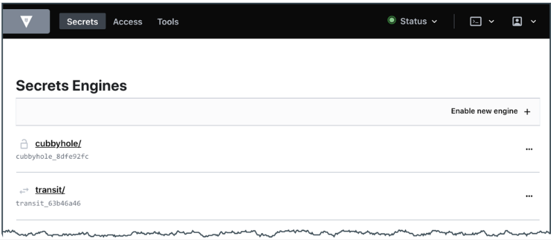
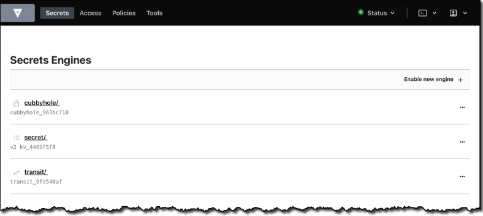
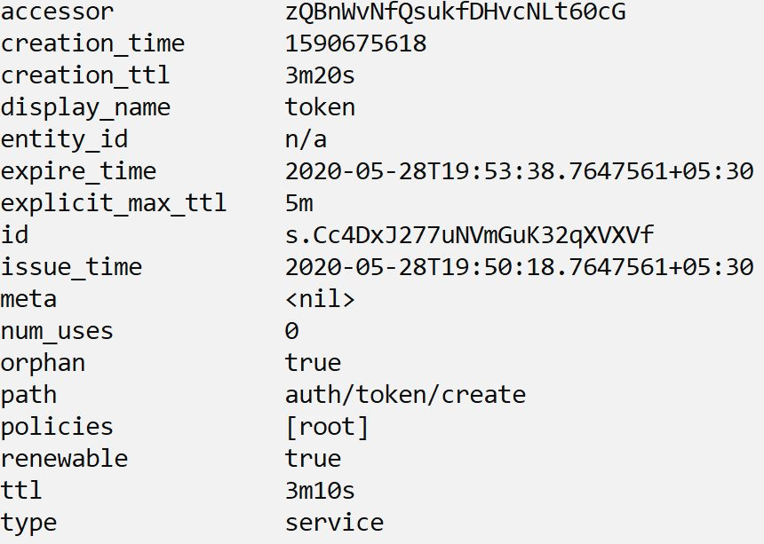

# Vault certificate preparation

## HashiCorp certifications

* Terraform Associate
* Vault Associate
* Consul Associate
  
---

## HashiCorp Security Automation Certification

* HashiCorp Certified: Vault Associate
* [HashiCorp Security Automation Certification](https://www.hashicorp.com/certification/vault-associate)
* Prerequisites
  * Basic terminal skills
  * Basic understanding of on premise or cloud architecture
  * Basic level of security understanding

---

## Exam Objectives

* Compare authentication methods
* Create Vault policies
* Assess Vault tokens
* Manage Vault leases
* Compare and configure Vault secrets engines
* Utilize Vault CLI
* Utilize Vault UI
* Be aware of the Vault API
* Explain Vault architecture
* Explain encryption as a service

Notes:

* https://www.udemy.com/course/hashicorp-certified-vault-associate/

---

## Quiz

* When Vault is sealed, it can access the physical storage but cannot read the data because it does not know how to decrypt them.
  * A. True
  * B. False

Notes:

A.

---

## Quiz

* Batch tokens can be renewed indefinitely.
  * A. True
  * B. False

Notes:

B.

---

## Quiz

* To seal a Vault, the client token must have the sudo capability on the sys/seal path.
  * A. True
  * B. False

Notes:

A.

---


## Quiz

* Which statement is true about an orphan token?

  * A. It does not expire when its parent does
  * B. It is not persisted 
  * C. It does not have a max time-to-live (TTL)
  * D. It has a use limit

Notes:

A. 

---

## Quiz

* Which path will this policy allow?
  
```terraform
path "kv/+/team_*" {
    capabilities = [ "read" ]
}
```
  * A. kv/team_edu
  * B. kv/us-west/team
  * C. kv/us-west/team_edu
  * D. kv/us-west/ca/team_edu

Notes:

C.

---

## Quiz

* What is true of Vault tokens? Choose TWO correct answers.

  * A. Vault tokens are generated by every authentication method login
  * B. Vault tokens are also known as unseal keys
  * C. Vault tokens are required for every Vault call
  * D. Vault token IDs always begin with "s." such as s.E7rOurS2n7m2Dt5409jWxR87
  * E. Vault tokens are the core method for authentication in Vault
  
Notes:

A., E.

---

## Quiz

* Which statements correctly describe the command below? Choose TWO correct answers.

```terraform
vault write transit/decrypt/password \
  ciphertext=vault:v1:8SDd3WHDOjf7mq69CyCqYjBXAiQQAVZRkFM13ok481zoCmHnSeDX9vyf7w==
```  

  * A. Returns an error due to missing encryption key name
  * B. Returns base64-encoded plaintext
  * C. Decrypts the ciphertext if the token permits
  * D. Returns the ciphertext
  * E. Requires sudo capability on the transit/decrypt/password path

Notes:

B., C.

---

## Quiz

* An organization needs to protect sensitive application data currently stored in a database as plaintext. Which secrets engine provides a solution?

  * A. Key/Value v2 secrets engine
  * B. Cubbyhole secrets engine
  * C. Transit secrets engine
  * D. Database secrets engine
  
Notes:

C.

---


## Quiz

* Which of the following statements explains the benefit of response wrapping? Choose TWO correct answers.
  * A. Limits the time of secret exposure by having a short-lived wrapping token
  * B. Allow versioning of the secrets
  * C. It protects Vault's master key
  * D. Only the reference to the secrets is transmitted over the public network
  * E. Limits the size of secrets to be transmitted over the network

Notes:

A., D.

---

## Quiz

* You need to edit a policy, but the UI appears as shown. What is the problem?
  


  * A. This is an UI error. Contact support.
  * B. You don't have a permission to manage policies.
  * C. Vault UI does not support policy creation and management.
  * D. Use the command shell in UI to manage policies.

Notes:

B.

---

## Quiz

* Where on the page would you click to display the list of available Vault-created encryption keys?



  * A. Cubbyhole/
  * B. Secrets/
  * C. Transit/

Notes:

C.

---

## Quiz

* Does Transit Secret Engine store the cipher-text data for future decryption requests?

  * A. True
  * B. False

Notes:

B.

---

## Quiz

* The main idea of Shamir's Sharing Algorithm is to protect?

  * A. SSL/TLS key
  * B. Root tokens
  * C. Master key
  * D. Encryption keys

Notes:

D.

---

## Quiz

* Matthew works as a security engineer in Medium Corp and is recently provided a project to set up the vault. Medium Corp extensively uses AWS and to protect the master key, they intend to make use of AWS KMS instead of shamir. How can this be achieved?

  * A. Shamir'a algorithm is the only choice available.
  * B. Add a new seal block in the configuration file, like KMS, and restart Vault with that
  * C. Use encryption at the server level
  * D. None of the above
  
Notes:

B.


---

## Quiz

* By default, how many keys are needed for the unsealing process based on Shamir in Vault?

  * A. 1
  * B. 2
  * C. 3
  * D. 4
  * E. 5
  
Notes:

C.

---

## Quiz

* Which of the following engine supports Dynamic secrets?

  * A. Key/Value version 1
  * B. Key/Value version 2
  * C. Cubbyhole
  * D. TOTP
  * E. Google cloud
  
Notes:

E. 

https://www.udemy.com/course/hashicorp-certified-vault-associate/learn/quiz/4903088#overview
Q5

---

## Quiz

* Why does Transit Secret engine require Base64 encoded data instead of just plain-text?

  * A. Base64 consumes less network traffic
  * B. Base64 encoding provides additional security from hackers
  * C. Base64 can be used to encode various objects such as binary files, PDFs, and images for encryption
  * D. Base 64 acts as an additional authentication step

Notes:

C.

---

## Quiz

* Enterprise Corp has started to make use of Vault in production environments. They intend to go with the replication feature to reduce the latency. They also want to be able to perform local reads on the replica that would be running in their secondary region. Which of the following approach can be used?

  * A. Disaster recovery replication
  * B. Replica replication
  * C. Performance replication
  * D. Performance replication with Disaster Recovery replication
  

Notes:

C.

---

## Quiz

* Medium Corp is making use of the Transit Secret Engine for encryption and decryption requests. They have a TLS connection from application to Vault and authentication based on AppRole auth method. They are making use of one encryption key to perform all the cryptographic operations.

* As a Vault Architect, what are the suggestions that you can provide to improve on this architecture?

  * A. Make use of SSL/TLS connection instead of just TLS
  * B. AppRole is not secure, make use of Token authentication
  * C. Key Rotation should be integrated, and all the data should not be encrypted with the single key
  * D. All of the above

Notes:

C. 

---

## Quiz

* Enterprise Corp is using Vault in its production. They want to make sure that a sufficient amount of replication is set up so that no data is lost. What is the best way to achieve this?

  * A. Performance replication
  * B. Disaster replication
  * C. Disaster recovery replication
  * D. High availability

Notes:

C.

---

## Quiz

* Can we make use of both Performance and DR replication together as part of the same cluster?

  * A. True
  * B. False

Notes:

A.

---

## Quiz

* What can be added as part of the Identity Groups?

  * A. Users
  * B. Tokens
  * C. Entities
  * D. Aliases

Notes:

C.

---

## Quiz

* Does the default policy allow writing data to the `secret/` path?

  * A. True
  * B. False

Notes:

B.

---

## Quiz

* Where is the cached data in the Vault agent stored?

  * A. In Sink location
  * B. In memory
  * C. In a special hidden location on disk
  * D. Vault agent does not support cache
  
Notes:

B.

---

## Quiz

* Medium Corp is designing an application, and they want it to be able to perform reads based on secret/ path in the vault. They do not want to configure any logic to store tokens and make requests with tokens. What is the way to achieve this?

  * A. Make use of Agent Auto-Auth method
  * B. Tokens are mandatory and any request that an application sends must include tokens. This cannot be done.
  * C. Make use of Vault agent caching
  * D. Use AppRole auth method

Notes:

C. 


---

## Quiz

* Does the default policy allow writing data to cubbyhole/ path?

  * A. True
  * B. False

Notes:

A.

---

## Quiz

* Can response wrapped token be used multiple times?

  * A. True
  * B. False

Notes:

B.

---

## Quiz

* In which of the following scenarios, using ROOT is mandatory?

  * A. Unsealing Vault
  * B. Initializing Vault
  * C. Configuring Audit devices
  * D. Starting Vault

Notes:

C.

---

## Quiz

* Can we make use of Token Accessor to perform authentication?

  * A. True
  * B. False

Notes:

B.

---

## Quiz

* Medium Corp is using the Key/Value engine of version 2. They plan to enable four K/V secret engines in Vault for different use-cases. Is this possible?


  * A. True
  * B. False

Notes:

A.

---

## Quiz

* Large Corp intends to enable the AWS Secret Engine. For 4 different AWS accounts, they want to make use of four secret engines of AWS type. How to uniquely identify between them if all of them are running?

  * A. Make use of the right version when enabling them
  * B. Mount them on different paths
  * C. Name them accordingly
  * D. You cannot use four different AWS secrets engines running at the same time

Notes:

B.

---

## Quiz

* AWS Secret Engine is mounted on the following path aws/

By mistake, James has run the following command:

`vault lease revoke -prefix aws/`

What is the impact of it?


  * A. Leases generated in the last 30 minutes will be revoked
  * B. All leases and configuration of AWS secrets engine will be removed
  * C. All leases in the AWS secrets engine will be revoked
  * D. None of the above

Notes:

C.

---

## Quiz

* What type of token is shown in the following screenshot?



  * A. Child token
  * B. Parent token
  * C. Sub token
  * D. User token

Notes:

B.

---

## Quiz

* Matthew wants to see which policies are associated with a specific token. Which of the following command is the ideal way of achieving the lookup?

  * A. `vault token lookup [ROOT TOKEN]`
  * B. `vault token lookup -accessor [CLIENT TOKEN]`

Notes:

B.

---

## Quiz

* The attacker was able to fetch the Accessor information associated with a token. Will he be able to reverse engineer a ROOT token from the accessor?

  * A. True
  * B. False

Notes:

B. 

---

## Quiz

* The secure application was receiving ciphertext data from the Transit Secret Engine. An attacker was able to intercept the data successfully. What should be the next steps that a Vault Administrator can perform according to best practice?

  * A. Nothing. Since it is ciphertext, the attacker will not be able to decrypt it
  * B. Rotate the encryption key and set the "minimum to decrypt" version to the latest version of the key
  * C. Delete and re-create a new transit secrets engine
  * D. None of the above

Notes:

B.

---

## Quiz

* When Dynamic Secrets are created in Vault, what attribute is used to further renew or revoke these secret?

  * A. Secret name
  * B. Vault accessor
  * C. Nothing is needed
  * D. revocation_id
  * E. lease_id

Notes:

E.

---

## Quiz

* When Dynamic Secrets are created in Vault, what attribute is used to further renew or revoke these secret?


  * A. `vault user login`
  * B. `vault register`
  * C. `vault auth`
  * D. `vault login`

Notes:

D.

---

## Quiz

* Can the userpass auth method in Vault read the usernames from external database like Active Directory?

  * A. True
  * B. False

Notes:

B.

---

## Quiz

* When Vault is first initialized, which one is among the default authentication methods available?

  * A. userpass
  * B. AppRole
  * C. GitHub
  * D. Tokens

Notes:

D.

---

## Quiz

* Vault Policies are designed to be `deny` by default?

  * A. True
  * B. False

Notes:

A.

---

## Quiz

* Alice needs to revoke all the secrets on a specific path. Which of the following commands can be used?

  * A. `vault revoke -all <path>`
  * B. `vault secret revoke -all <path>`
  * C. `vault lease revoke -all <path>`
  * D. `vault lease revoke -prefix <path>`

Notes:

D.

---

## Quiz

* Does Vault trust the storage backend by default?

  * A. True
  * B. False

Notes:

B.

---

## Quiz

* What is the maximum TTL of a token if no explict TTL is specified?

  * A. 10 days
  * B. 24 hours
  * C. 30 days
  * D. 32 days
  * E. Unlimited

Notes:

D.

---

## Quiz

* Which command is used to renew a vault token?

  * A. `vault renew token`
  * B. `vault token update`
  * C. `vault token renew`
  * D. `vault modify token`

Notes:

C. 

---

## Quiz

* Unsealing Vault creates the encryption keys, which is used to unencrypt the data on the storage backend

  * A. True
  * B. False

Notes:

B.

---

## Quiz

* Which of the following best describes a token accessor?

  * A. Describes the value associated with the token TTL
  * B. A value that acts as a reference to a token and can only be used to perform limited actions
  * C. A value that describes which clients have access to the attached token
  * D. A token used for Consul to access Vault auth methods
  
Notes:

B.

---

## Quiz

* In order to extend Vault beyond a data center or cloud regional boundary, what feature should be used?

  * A. Vault plugins
  * B. Vault authentication
  * C. Vault replication
  * D. Vault extender

Notes:

C.

---

## Quiz

* Which is the right command to enable the AWS Secret engine via CLI?

  * A. `vault secrets aws enable`
  * B. `vault enable secrets aws`
  * C. `vault secrets enable aws`
  * D. `vault enable aws secrets engine`

Notes:

C.

---

## Quiz

* When the parent tokens are revoked, what happens to the child tokens?

  * A. Child tokens continue to exist till the lease expires
  * B. Child tokens will be converted to parent tokens
  * C. Child tokens will also be revoked
  * D. None of the above

Notes:

C.

---

## Quiz

* Which among the authentication methods below is recommended when application running on a server needs to perform operations on Vault?

  * A. GitHub
  * B. SSH
  * C. Tokens
  * D. AppROle
  * E. SSO provider like Okta

Notes:

D.

---

## Quiz

* 

  * A. True
  * B. False

Notes:


---

## Quiz

*

  * A. True
  * B. False

Notes:


---

## Quiz

*

  * A. True
  * B. False

Notes:


---

## Quiz

*

  * A. True
  * B. False

Notes:


---

## Quiz

*

  * A. True
  * B. False

Notes:


---

## Quiz

*

  * A. True
  * B. False

Notes:


---

## Quiz

*

  * A. True
  * B. False

Notes:


---

## Quiz

*

  * A. True
  * B. False

Notes:


---

## Quiz

*

  * A. True
  * B. False

Notes:


---

## Quiz

*

  * A. True
  * B. False

Notes:


---

## Quiz

*

  * A. True
  * B. False

Notes:


---

## Quiz

*

  * A. True
  * B. False

Notes:


---

## Quiz

*

  * A. True
  * B. False

Notes:


---


