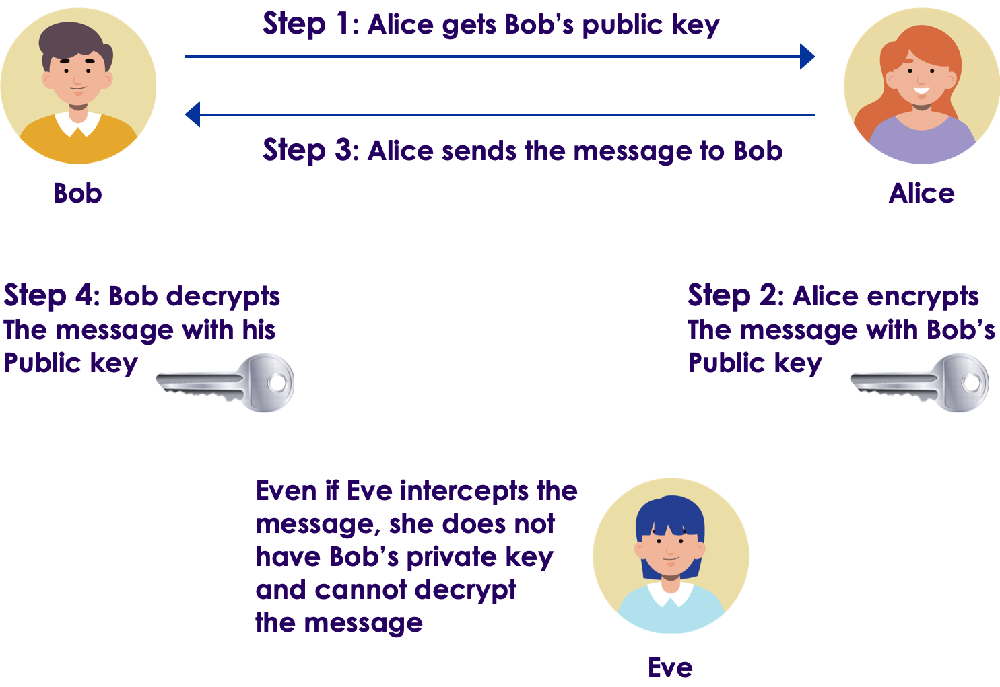
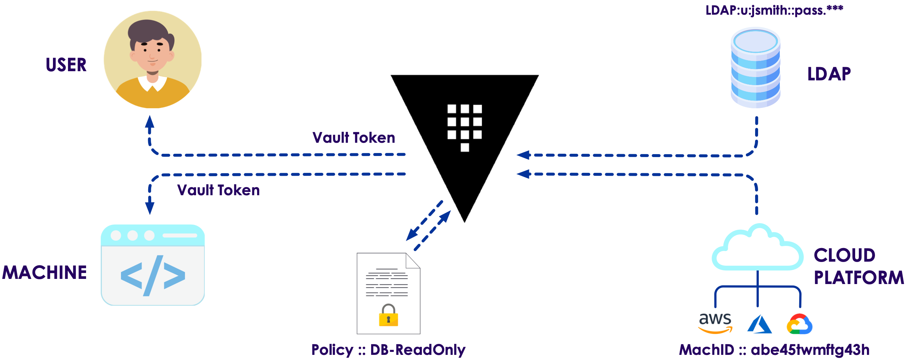
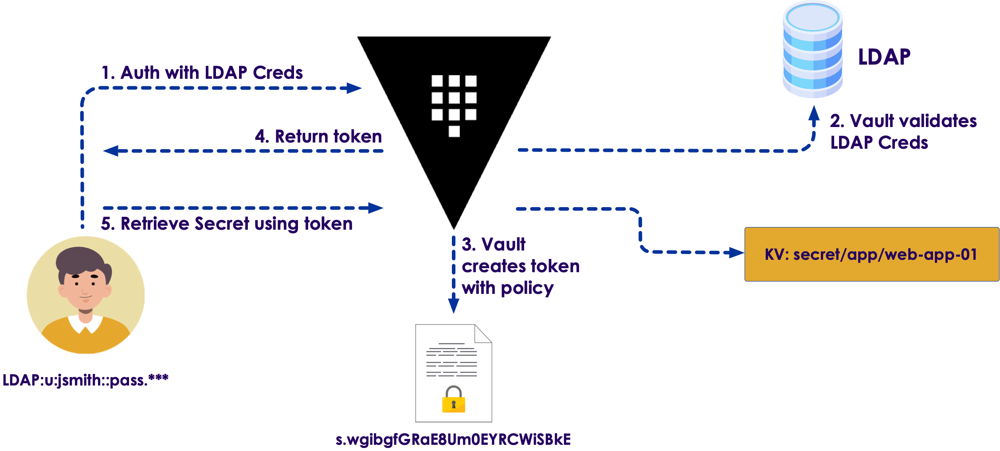
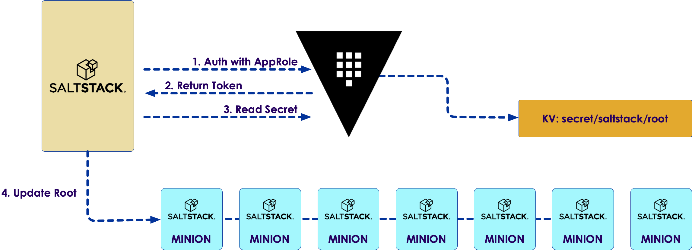

# Vault Architecture

# Vault introduction

## Imagine going on vacation

* The receptionist asks for your identity
* After it is verified, you get the room key
* With Vault, it is just as easy

Notes:

* Imagine that someone is taking a vacation to a beautiful and exotic location. 
* Their trip would begin with their arrival at the hotel to check in to their room. 
* At the front desk, the receptionist asks for the person to prove their identity by providing credentials. 
* The receptionist would then check their credentials against the hotel record on file and determine that they are whom they say they are. 
* After verifying the guest's identity, the receptionist would issue the guest a room key. 
* The specific level of access granted to the guest would depend on the guest's relationship with the hotel. 
* Where a first-time guest might only receive access to their room and the hotel gym, 
a returning guest may also receive access to the guest lounge for their loyalty.

---

## Hotel entry

* Hotel guest
  * Many entrances
  
* Vault client
  * Variety of interfaces 
    * API
    * CLI
    * UI

---

## Hotel protection

* Hotel
  * Walls and dooar
  
* Vault
  * cryptographic barrier
    * responsible for encrypting all information stored by Vault

---

## Hotel guests

* Guest objective
  * Access their rooms
  * First, they check in
  
* Vault client objective
  * Access data from a secrets engine
  * First, they authenticate  
    * Vault validates the credentials of the user 
    * through a configured **auth method**
    * to ensure those credentials are valid
  * Vault issues a token  

---

## Lab: - Install Vault

* Please do lab `lab01`
* It is found here: [https://github.com/elephantscale/vault-consul-labs-answers/tree/main/lab01](https://github.com/elephantscale/vault-consul-labs-answers/tree/main/lab01)

---

## Vault's token
* Token is issued to the client
  * Based on the policy for that user
* Token permits access to different endpoints in Vault, called **paths**
* Token has a time-to-live (TTL)

---

## Vault basic components

* Paths
* Secrets engines
* Auth methods
* Tokens
* Policies

---

## Paths  

* the basic building blocks of Vault
* every endpoint in Vault is accessible through a path
* paths provide access to
    * secrets engines
    * policies
    * auth methods
    * static secret values
    * system health information.

Notes:

* Paths are the basic building blocks of Vault. 
* Like the hallways of a hotel, every endpoint in Vault is accessible through a path.
* These paths provide access to everything within Vault, including secrets engines, policies, auth methods, static secret values, and system health information. 
* After a component is enabled in Vault, all interactions with that component are performed using the associated path. 
* Even Vault's administrative functions are configured using a path.

---

## Secrets engines

* Secrets Engines Secrets engines provide Vault's core functionality
* Each secrets engine has its own specific function
  * static secret data
  * short-lived, dynamic credentials
  * encrypt plaintext data in transit
  

Notes:

* Secrets Engines Secrets engines provide Vault's core functionality, and without secrets engines, there is no point in deploying Vault. 
* The specific function of each secrets engine, however, can vary. 
  Some secrets engines store static secret data, while other secrets engines can generate a set of short-lived, dynamic
  credentials. Some can even encrypt plaintext data in transit. 
* All other Vault components can be seen as supporting components to secrets engines.

---

## Auth methods

* Auth methods are responsible for 
  * assessing identity 
  * assigning a set of policies to a user or machine. 
  * validate authentication requests
  * method examples 
    * Active Directory
    * LDAP 
    * GitHub 
    * Kubernetes 
    * Okta

Notes:

* Auth Methods Auth methods are responsible for assessing identity and assigning a set of policies to a user or machine. 
* Like the front desk at a hotel, auth methods validate authentication requests 
* through the configured identity provider 
* to ensure the credentials are valid before granting access to services. 
* Examples of auth methods include Active Directory, LDAP, GitHub, Kubernetes, Okta, 
*  and identity management services on the major cloud providers.

---

## Tokens

* Tokens are the core method of authentication within Vault. 
  * configured to use tokens directly as an authentication mechanism, or
  * an auth method can be used to generate dynamic tokens based on external identities
  
Notes: 

* Tokens are the core method of authentication within Vault. 
* Vault can be configured to use tokens directly as an authentication mechanism, 
* or an auth method can be used to generate dynamic tokens based on external identities. 
* Regardless of how Vault clients authenticate to Vault, a token will be used for all subsequent requests.

--- 

## Policies 

* Policies determine the level of access an entity has to a particular path
* or the data contained therein once the entity has authenticated. 
* Permissions: "CRUD" 
  * applied to a particular path and associated with specific Vault clients 
  * or applied service-wide

Notes:

* Policies determine the level of access an entity has to a particular path or the data contained therein once the entity has authenticated. 
* Permissions defined inside of these policies follow the typical "CRUD" model of access: Create, Read, Update, Delete. 
* These permissions or "capabilities" are applied to a particular path and associated with specific Vault clients or applied service-wide. 
* Certain "parameters" can be associated with the policies to tighten security controls around specific actions further. 
* In summary, while auth methods handle authentication to Vault, policies control authorization to Vault components once a client has successfully authenticated.

---

## Lab: - Start Vault

* Please do lab `lab02`
* It is found here: [https://github.com/elephantscale/vault-consul-labs-answers/tree/main/lab02](https://github.com/elephantscale/vault-consul-labs-answers/tree/main/lab02)

---

## Terminology

* Storage Backend
* Barrier
* Secrets Engine
* Audit Device
* Auth Method
* Client Token
* Secret
* Server

Notes:

Storage Backend - A storage backend is responsible for durable storage of encrypted data. Backends are not trusted by Vault and are only expected to provide durability. The storage backend is configured when starting the Vault server.

Barrier - The barrier is cryptographic steel and concrete around the Vault. All data that flows between Vault and the storage backend passes through the barrier. The barrier ensures that only encrypted data is written out, and that data is verified and decrypted on the way in. Much like a bank vault, the barrier must be "unsealed" before anything inside can be accessed.

Secrets Engine - A secrets engine is responsible for managing secrets. Simple secrets engines like the "kv" secrets engine simply return the same secret when queried. Some secrets engines support using policies to dynamically generate a secret each time they are queried. This allows for unique secrets to be used which allows Vault to do fine-grained revocation and policy updates. As an example, a MySQL secrets engine could be configured with a "web" policy. When the "web" secret is read, a new MySQL user/password pair will be generated with a limited set of privileges for the web server.

Audit Device - An audit device is responsible for managing audit logs. Every request to Vault and response from Vault goes through the configured audit devices. This provides a simple way to integrate Vault with multiple audit logging destinations of different types.

Auth Method - An auth method is used to authenticate users or applications which are connecting to Vault. Once authenticated, the auth method returns the list of applicable policies which should be applied. Vault takes an authenticated user and returns a client token that can be used for future requests. As an example, the userpass auth method uses a username and password to authenticate the user. Alternatively, the github auth method allows users to authenticate via GitHub.

Client Token - A client token (aka "Vault Token") is conceptually similar to a session cookie on a web site. Once a user authenticates, Vault returns a client token which is used for future requests. The token is used by Vault to verify the identity of the client and to enforce the applicable ACL policies. This token is passed via HTTP headers.

Secret - A secret is the term for anything returned by Vault which contains confidential or cryptographic material. Not everything returned by Vault is a secret, for example system configuration, status information, or policies are not considered secrets. Secrets always have an associated lease. This means clients cannot assume that the secret contents can be used indefinitely. Vault will revoke a secret at the end of the lease, and an operator may intervene to revoke the secret before the lease is over. This contract between Vault and its clients is critical, as it allows for changes in keys and policies without manual intervention.

Server - Vault depends on a long-running instance which operates as a server. The Vault server provides an API which clients interact with and manages the interaction between all the secrets engines, ACL enforcement, and secret lease revocation. Having a server based architecture decouples clients from the security keys and policies, enables centralized audit logging and simplifies administration for operators.

---

## Vault architecture

Notes:

* Let's begin to break down this picture. There is a clear separation of components that are inside or outside of the security barrier. Only the storage backend and the HTTP API are outside, all other components are inside the barrier.

* The storage backend is untrusted and is used to durably store encrypted data. When the Vault server is started, it must be provided with a storage backend so that data is available across restarts. The HTTP API similarly must be started by the Vault server on start so that clients can interact with it.

---

## Lab: - Write a Secret

* Please do lab `lab03`
* It is found here: [https://github.com/elephantscale/vault-consul-labs-answers/tree/main/lab03](https://github.com/elephantscale/vault-consul-labs-answers/tree/main/lab03)

--- 

## In the real world, Vault starts sealed

Notes:

* Once started, the Vault is in a sealed state. 
* Before any operation can be performed on the Vault it must be unsealed. This is done by providing the unseal keys. 
* When the Vault is initialized it generates an encryption key which is used to protect all the data. That key is protected by a master key. 
* By default, Vault uses a technique known as Shamir's secret sharing algorithm to split the master key into 5 shares, any 3 of which are required to reconstruct the master key.

---

## RSA 

* Vault is based on asymmetric cryptography and RSA
* Vault packages these so that it 'just works'
* Let's spend a few minutes with the basic overview

Notes:

* The number of shares and the minimum threshold required can both be specified. Shamir's technique can be disabled, and the master key used directly for unsealing. Once Vault retrieves the encryption key, it is able to decrypt the data in the storage backend, and enters the unsealed state. Once unsealed, Vault loads all of the configured audit devices, auth methods, and secrets engines.

* The configuration of those audit devices, auth methods, and secrets engines must be stored in Vault since they are security sensitive. Only users with the correct permissions should be able to modify them, meaning they cannot be specified outside of the barrier. By storing them in Vault, any changes to them are protected by the ACL system and tracked by audit logs.

---

## What is asymmetric cryptography?

* One key is used to encrypt a message and a different (but related) key is used to decrypt it. 
* This seems baffling at first
* This will be clearer once we look at some algorithms and a bit of math. 
* For now, we will accept that one key encrypts but cannot decrypt the message; another key is used to decrypt it.

Notes:

In asymmetric cryptography, as the name suggests, one key is used to encrypt a message and a different (but related) key is used to decrypt it. This concept often baffles those new to cryptography and students in network security courses. How can it be that a key used to encrypt will not also decrypt? This will be clearer to you once we examine a few algorithms and you see the actual mathematics involved. For now, set that issue to one side and simply accept that one key encrypts but cannot decrypt the message; another key is used to decrypt it.

---

## Why asymmetric cryptography?

* Symmetric cryptography has a serious problem. 
* That problem is key exchange and the potential for compromise.
* Enter Alice, Bob, and Eve
  * Alice would like to send Bob a message. 
  * But Eve might eavesdrop!
  * Bob and Alice do not live in the same location, how do they exchange the key? 
  * (Short of a secure/trusted courier manually taking the keys to the two parties.)
  

Notes:

* Symmetric cryptography (which you studied in Chapters 6 and 7) has a serious problem. That problem is key exchange and the potential for compromise. Let’s look at an example to demonstrate. For some reason, all security and cryptography books like to use the fictitious characters Alice, Bob, and Eve to explain how asymmetric cryptography works, and I will continue that tradition here.
* Let’s assume, then, that Alice would like to send Bob a message. But Alice is concerned that Eve might eavesdrop (thus her name!) on the communication. Now let’s further assume that they don’t have asymmetric cryptography—all they have are the symmetric ciphers. Further, Bob and Alice do not live in the same location, so how can they exchange a key so that they might encrypt messages? Any method (other than asymmetric cryptography) has the very real chance of being compromised, short of a secure/trusted courier manually taking the keys to the two parties. (If a courier was needed to exchange keys every time secure communication was required, then we would not have online banking, e-commerce, or a host of other useful technologies.)

---

## Asymmetric cryptography - problem solved!

Notes:

* With public key/asymmetric cryptography, Alice will get Bob’s public key and use that to encrypt the message she sends to Bob. If Eve intercepts the message and gains access to Bob’s public key, that’s OK, because that key won’t decrypt the message. Only Bob’s private key will do so, and this he safeguards.
* If Bob wants to respond to Alice, he reverses the process. He gets Alice’s public key and encrypts a message to her—a message that only her private key will decrypt.

---

## Lab: Secret Engines

* Please do lab `lab04`
* It is found here: [https://github.com/elephantscale/vault-consul-labs-answers/tree/main/lab04](https://github.com/elephantscale/vault-consul-labs-answers/tree/main/lab04)

---

## After Vault is unsealed

* After the Vault is unsealed
  * requests can be processed from the HTTP API to the Core. 
  * The core is used to 
    * manage the flow of requests through the system, 
    * enforce ACLs, and 
    * ensure audit logging is done.

* The client needs to authenticate. 
  * Vault provides configurable auth methods
  * Provides flexibility in the authentication mechanism used

Notes:

* After the Vault is unsealed, requests can be processed from the HTTP API to the Core. The core is used to manage the flow of requests through the system, enforce ACLs, and ensure audit logging is done.

* When a client first connects to Vault, it needs to authenticate. Vault provides configurable auth methods providing flexibility in the authentication mechanism used. Human friendly mechanisms such as username/password or GitHub might be used for operators, while applications may use public/private keys or tokens to authenticate. An authentication request flows through core and into an auth method, which determines if the request is valid and returns a list of associated policies.

---

## Lab: Dynamic Secrets

* Please do lab `lab05`
* It is found here: [https://github.com/elephantscale/vault-consul-labs-answers/tree/main/lab05](https://github.com/elephantscale/vault-consul-labs-answers/tree/main/lab05)

---

## Lab: Built-in Help

* Please do lab `lab06`
* It is found here: [https://github.com/elephantscale/vault-consul-labs-answers/tree/main/lab06](https://github.com/elephantscale/vault-consul-labs-answers/tree/main/lab06)

---

## Policies

* Policies are just a named ACL rule
* Example:
  * the "root" policy is built-in and permits access to all resources
  

Notes:

* Policies are just a named ACL rule. For example, the "root" policy is built-in and permits access to all resources. You can create any number of named policies with fine-grained control over paths. Vault operates exclusively in a whitelist mode, meaning that unless access is explicitly granted via a policy, the action is not allowed. Since a user may have multiple policies associated, an action is allowed if any policy permits it. Policies are stored and managed by an internal policy store. This internal store is manipulated through the system backend, which is always mounted at sys/.

* Once authentication takes place and an auth method provides a set of applicable policies, a new client token is generated and managed by the token store. This client token is sent back to the client, and is used to make future requests. This is similar to a cookie sent by a website after a user logs in. The client token may have a lease associated with it depending on the auth method configuration. This means the client token may need to be periodically renewed to avoid invalidation.

* Once authenticated, requests are made providing the client token. The token is used to verify the client is authorized and to load the relevant policies. The policies are used to authorize the client request. The request is then routed to the secrets engine, which is processed depending on its type. If the secrets engine returns a secret, the core registers it with the expiration manager and attaches a lease ID. The lease ID is used by clients to renew or revoke their secret. If a client allows the lease to expire, the expiration manager automatically revokes the secret.

* The core handles logging of requests and responses to the audit broker, which fans the request out to all the configured audit devices. Outside of the request flow, the core performs certain background activity. Lease management is critical, as it allows expired client tokens or secrets to be revoked automatically. Additionally, Vault handles certain partial failure cases by using write ahead logging with a rollback manager. This is managed transparently within the core and is not user visible.

---

## The Vault Service Process

* Phase 1 - Preparation
* Phase 2 - User Interaction
* Phase 3 - Cleanup

Notes:

* There are many aspects to preparing Vault to handle client requests on a day-to-day basis.
* Generally, there are three phases to prepare a production-ready Vault environment: the
configuration, the client interaction, and post-client events.
* Each phase is uniquely essential to building a working Vault environment.

---

## Phase 1 - Preparation

* The database secrets engine must be configured with an administrative credential
* An auth method must be configured to permit access
* A Vault policy that grants permission to the database secrets engine needs to be

Notes:

* The first phase involves the actions performed by an administrator to enable user
interaction. Before a Vault client can retrieve a database credential from Vault, for example,
there are configuration items that must be in place:
* The database secrets engine must be configured with an administrative credential
capable of creating dynamic user accounts with appropriate permissions on the
target database.
* An auth method must be configured to permit access to the entity requesting
access to the database.
* A Vault policy that grants permission to the database secrets engine needs to be
created and attached to the entity.

---

## Phase 2 - User Interaction

* This phase is interaction from the user
* When a client sends a request to Vault 
  * the request is initiated using TLS
  * verify the identity of the Vault service and 
  * establish secure communication with it
  
---

## Basic workflow of client interaction

1. The client sends an authentication request to Vault, specifying the auth method and
   credentials to be used.
2. Vault forwards those credentials to the appropriate authentication backend for
   verification.
3. Vault receives approval returns an access token
4. The Vault client uses the access token to issue a read
5. Vault validates the token 
6. If permitted, Vault will use pre-configured database credentials to generate temporary database credentials
   

Notes: 

1. The client sends an authentication request to Vault, specifying the auth method and
   credentials to be used.
2. Vault forwards those credentials to the appropriate authentication backend for
   verification.
3. Vault receives approval from the appropriate authentication backend and returns an
   access token to the requestor based on the policies associated with the requestor.
4. The Vault client uses the access token to issue a read request to the associated
   path to generate database credentials.
5. Vault validates the token and the associated policy to determine whether access to a
   database credential should be granted.
6. If the token is permitted to access the requested path, Vault will use pre-configured
   database credentials to generate temporary database credentials based on the
   policy associated with the requestor. The database credentials are returned to the
   requestor.
---

## Phase 3 - Cleanup

* Once user interaction is complete,
  * Vault needs to clean up the token. 
* When a token or other credential is provisioned by Vault, 
  * it is associated with a TTL or "lease." 
  * This lease may be 
    * time-based, such as 24 hours, 
    * defined by a set number of uses. 
* After the lease expires,
  * the tokens are revoked, and
  * the associated credentials are removed automatically by Vault.
  
---

## Lab: Authentication

* Please do lab `lab07`
* It is found here: [https://github.com/elephantscale/vault-consul-labs-answers/tree/main/lab07](https://github.com/elephantscale/vault-consul-labs-answers/tree/main/lab07)

---

## Database example

Notes:
* Figure 1-1 illustrates the database example, where a Vault client needs access to database
credentials to read data inside the database. 
* Phase 1 of this example includes the
configuration of the LDAP and Cloud auth method, the policy creation, and the database
secrets engine configuration. 
* When a Vault client sends an authentication request using
LDAP, for example, the workflow in Phase 2 is executed. 
* The client obtains a token and requests database credentials. 
* Once the client interaction is completed, the token will
expire, and the database credentials will be revoked.

---

## Philosophy of Vault

* The intent and philosophy of Vault is to build security
  * into automated processes
  * that utilize temporary credentials
  * whether for a specific duration or one-time use. 
* The ultimate goal
  * migrate from static credentials and identities that **require periodic manual rotation***.
  * Of course, this workflow can still be leveraged for static secrets as well.
  
---

## Interacting with Vault

* It is critical for developers and Vault operators to understand 
  * the details of the user interaction process
  * as they add integrations. 
* The previous section introduced this process at a high-level
* Additional context on the day-to-day use of Vault
  * will significantly benefit the consumers of the Vault service.
  
## The Vault API

* Secrets Engines
  * provide the core functionality of Vault 
  * maintain static values
  * generate dynamic credentials
  * perform cryptographic functions.
* Auth Methods
  * validating authentication requests from Vault clients 
  * authorizing the user to perform actions in Vault
* System Backend
  * Intended primarily for service administrators 
    * configure the components and features within Vault

Notes:

* Every interaction with Vault happens through the API, regardless of the entry point. Even
when clients interact with the CLI or web interface, the actions requested are performed
using the API. While the CLI and web interface are friendlier to end users, they do not
support all the actions that can be made by using the API directly.
The API is divided into three main sections:
* Secrets Engines
* These provide the core functionality of Vault. Secrets engines can maintain static values,
generate dynamic credentials, or perform cryptographic functions.
* Auth Methods
* These are responsible for validating authentication requests from Vault clients and
authorizing the user to perform actions in Vault. HashiCorp Vault can use an external
identity provider for authentication or provide internal identity management for granting
access to secrets.
* System Backend
* This endpoint is intended primarily for service administrators to configure the components
and features within Vault. The system backend can also be used by external services to
monitor Vault, such as a third-party monitoring solution or a load balancer health check.

---

## Vault Interfaces

* Using the API
  * Programmatic interaction with Vault occurs when an application or service calls the Vault
API
* Using the CLI
* Before configuring traditional application integration with the API, the CLI is often used to
configure Vault
* Using the Web UI
  * The Vault UI is accessible using modern web browsers
   *The UI can be accessed using the DNS name or hostname of the cluster and the configured port of the listener.

Notes:

* Using the API
* Programmatic interaction with Vault occurs when an application or service calls the Vault
API. This method should be the most common form of interaction with Vault. Interaction
using the API is what Vault was designed for – a completely hands-off, automated secrets
management experience. Automating complex tasks removes the human element, reduces
organizational risk, and improves security.
* Using the CLI
* Before configuring traditional application integration with the API, the CLI is often used to
configure Vault. The CLI simplifies the administration of the Vault service when performing
initial Vault tasks, such as migrating secrets to Vault. Once the initial configuration has
concluded, most of the day-to-day interactions can move to a programmatic function.
Almost all the accessible API paths are available in the CLI, with few exceptions.
* The CLI is the ideal method for Vault operators or users who might be more comfortable
using a command line to perform manual interactions with Vault instead of clicking around in
the web interface. Interaction through the CLI occurs through the same binary that is used
to operate the Vault service. A user may issue CLI commands directly on a Vault node, or
the binary may be downloaded on a local workstation to streamline access to Vault.
* Using the Web UI
* The Vault UI is accessible using modern web browsers. The UI can be accessed using the
DNS name or hostname of the cluster and the configured port of the listener.
For some users, the web interface is the most appropriate choice for accessing Vault.
Although Vault was not initially designed with a user interface in mind, the web UI has
quickly become a focus of development. Recent Vault releases have included significant
improvements to the UI, adding new features and capabilities. The most common tasks a
user or administrator might need to perform can be executed using the Vault web UI.
  
---

## General Consumer Interaction

* Basic human actions executed against the Vault service. 
  * authenticate with Vault
  * receive an access token
  * use the token to manage Vault or read a secret.

Notes:

* General consumer interactions consist of the basic human actions executed against the
Vault service. This type of interaction is often how users first approach Vault when the
20service is initially deployed. Under this category of interaction, a human user would
authenticate with Vault, receive an access token, and use the token to manage Vault or
read a secret.
* Many of the standard authentication providers used today, such as directory services, OIDC
solutions, or public cloud identity services, can be leveraged to validate human users.
  
---

## General Consumer Interaction

Notes:

* Example: 
* Jane Smith needs to retrieve the latest value of the root password for one of the
Linux hosts she manages. 
* Jane uses the Vault CLI to log in to Vault using her LDAP
username and password. 
*  Once authenticated, Vault returns an access token to Jane. Jane
then uses that access token to retrieve the value of the desired secret from a specific path
in Vault.
   
---

## Lab: Authentication

* Please do lab `lab08`
* It is found here: [https://github.com/elephantscale/vault-consul-labs-answers/tree/main/lab08](https://github.com/elephantscale/vault-consul-labs-answers/tree/main/lab08)

---

## Administrative Interaction

* Human entity usually performs administrative interactions during both the deployment and initial management phases of the Vault service. 
* Tend to shift to programmatic interactions as the service matures 
* However, administrative interactions shift toward management of the Vault service rather than the management of secrets.

Notes:

* Like consumer interactions, a human entity usually performs administrative interactions
during both the deployment and initial management phases of the Vault service. The
administrative interactions also tend to shift to programmatic interactions as the service
matures and grows. 
* However, administrative interactions shift toward management of the
Vault service rather than the management of secrets.

---

## More Administrative Interaction

* It is common to use Endpoint Governing Policies (EGPs) to ensure the second factor of authentication is used for privileged users. 
* For example
  * all Vault users need to provide an LDAP username and password. 
  * Vault administrators must also use a second factor of authentication, such as an Okta Verify push notification. 
  * Increases the security of privileged user access.
  * configuring the Okta push to trigger at auth/ldap would initiate an Okta push for all users authenticating through LDAP

Notes:

* Vault administrators commonly use the same auth methods that are leveraged by other
human users. 
*  However, it is common to use Endpoint Governing Policies (EGPs) to ensure
the second factor of authentication is used for privileged users. For instance, all Vault users
need to provide an LDAP username and password. However, Vault administrators must
also use a second factor of authentication, such as an Okta Verify push notification. 
*   This
strategy increases the security of privileged user access.
When using an EGP to configure the second factor of authentication, the policy can be
written to trigger the second factor based on the path requested. 
* For instance, configuring
the Okta push to trigger at auth/ldap would initiate an Okta push for all users authenticating
through LDAP. However, configuring the Okta to push to trigger at auth/ldap/users/jdoe
would initiate an Okta push only for Jon Doe.
* In this scenario, both the LDAP auth method and Okta MFA provider must be configured in
Vault before the EGP can be used for triggering the second factor of authentication.

---

## Admin interaction example

Notes:

* Jon Doe needs to create a namespace in Vault for a new team onboarding to
  Vault. Jon uses the Vault CLI to log in to Vault using his LDAP username and password.
  Jon receives an Okta Verify to verify his identity. Once authenticated, Jon receives an
  access token from Vault with administrative privileges. Jon uses his token to create and
  configure a new namespace in Vault.
  
---

## Security and Compliance Interaction

* Security and compliance personnel must ensure the Vault service is secure
* security and compliance personnel have secrets that need to be stored and managed. 
* Also, need to ensure that the Vault service is being consumed in a secure and compliant manner
  * penetration testing 
  * static code analysis.
  * Frequently use the Vault audit data to monitor operations using log aggregation
and analytics tools
      * Splunk or an ELK stack

Notes:

* While Vault can increase the overall security of integrated applications, security and
compliance personnel must ensure the Vault service is secure. The security and compliance
team may interact with Vault in a variety of ways. 
*  The first type of interaction is based on a
need for secrets management and aligns with general consumer interactions. Typically,
security and compliance personnel have secrets that need to be stored and managed. 
*   The
security and compliance teams also need to ensure that the Vault service is being
consumed in a secure and compliant manner along validating the security of the Vault
service. 
* This would include processes such as penetration testing or static code analysis.
To ensure Vault is running and being consumed securely, the security and compliance
teams will frequently use the Vault audit data to monitor operations using log aggregation
and analytics tools, such as Splunk or an ELK stack.

---

## Security flow example

Notes:

* Example: 
*  A Vault user authenticates with Vault and receives an access token. The access
token is used in an attempt to retrieve a secret that the user does not have access to read.
* The user's request is denied, and a log entry for the event is generated through an audit
device and ingested into Splunk. 
*  A notable security event is sent to the security operations
center (SOC) for investigation

---

## Vault Programmatic Interaction

* Vault has robust API
  * For DevOps and public cloud migration
* The 
  * Have the majority of interactions take place through automation using the API directly
      * authenticate with Vault,
      * receive a token
      * use it to retrieve a secret.
  
* AppRole auth method
  * RoleID (username) and a SecretID (password) 
  * the client receives a token in response that can be used to retrieve a secret.

Notes:

One of Vault’s most compelling features is its robust API, especially in organizations
adopting a DevOps culture or migrating applications to the public cloud. The goal is to have
the majority of interactions take place through automation using the API directly. This form
of interaction requires the entity (usually an application or host) to authenticate with Vault,
receive a token, and use it to retrieve a secret.
One of the most common auth methods used for this machine-to-machine interaction is the
AppRole auth method. This auth method uses a RoleID (username) and a SecretID
(password) to authenticate a non-human entity with Vault. As a result of authentication, the
client receives a token in response that can be used to retrieve a secret.

---

## Programmatic Interaction

Notes:

* A root password on a group of Linux hosts needs to be rotated. 
*  These hosts are
using SaltStack for configuration management. 
*   On the Salt master, a process is triggered to
rotate the root password on all Salt minions. 
*    The Salt master uses a RoleID and a SecretID,
configured in environment variables, to authenticate with Vault and retrieve a short-lived
access token. 
*     The Salt master then uses this token to read a secret value at a specified
path in Vault and sends this value to all attached minions. Once received, each minion
updates the local root password with the specified secret value.

---
# Vault Real-World

## Deploy

---

## HTTP API

---

## Web UI

---

