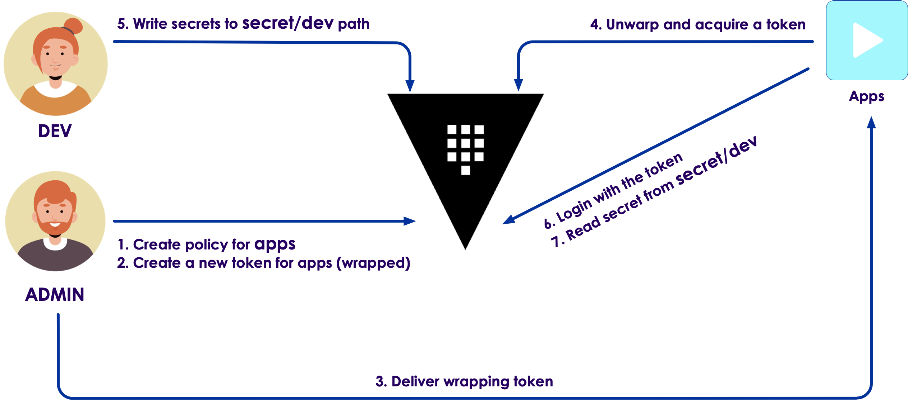
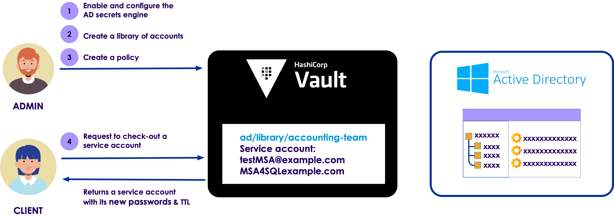

# Vault Configuration

# How does Vault encrypt data?

## How does Vault encrypt data?

* Vault encrypts data by leveraging a few key sources. 
    * The libraries that Vault uses, or the cryptography modules
    * Golang's crypto and 
    * x/crypto libraries that are part of the golang language.
  

---

## Vault cryptography libraries

* Kerckhoffs's principle
  * A cryptosystem should be secure even if everything about the system, except the key, is public knowledge
  * No security-by-obscurity
  
* Shannon's maxim
  * The enemy knows the system
  
* HashiCorp principle
  * the source code for how you encrypt and decrypt data should be open source

Notes:

This is very important and it's part of our open-source story because we at HashiCorp abide by something called Kerckhoffs's principle. Kerckhoffs's principle is a principle that comes from a 19th-century military cryptologist who stated that basically there is no security in obscurity. If you have a very secure system that everything that talks about how that system protects itself should be visible.

We translate that into modern times to mean that the source code for how you encrypt and decrypt data should be open source, and that's why HashiCorp's Vault source code for how it—Vault—handles encryption is all composed in its open-source binary. You can go into GitHub and take a look at it now, for example.

---

## Cryptography at HashiCorp

* Leverage those Golang crypto and x/crypto libraries 
  * for heavy lifting associated with encrypting and decrypting data
    
* Those libraries contain the methods and functions 
  * implementations of various algorithms like AES256
  * for internally encrypting data and decrypting data
  * allowing you to leverage cryptography without     
  

Notes:

So we leverage those Golang crypto and x/crypto libraries to handle the heavy lifting associated with encrypting and decrypting data. Those libraries contain the methods and functions that are the implementations of various algorithms like AES256 that are used within Vault, for either internally encrypting data and decrypting data or fo—as part of our transit backend—allowing you to leverage cryptography without having to deploy your own cryptographic infrastructure.

---

## Vault key management

* How does Vault manage keys that are associated with these cryptographic functions? 
* Vault handles this all through its own internal keyring
  * open source
  * not require a user to integrate into something like an HSM (Hardware security module) unless they want to.

Notes:

There's also this element of key management, how does Vault manage keys that are associated with these cryptographic functions? Vault handles this all through its own internal keyring, which is again also in open source, and allows Vault to not have to require a user to integrate into something like an HSM (Hardware security module) unless they want to.

---

## Entropy and Cybersecurity

* Entropy is the foundation upon which all cryptographic functions operate. 
  * It is a measure of the randomness or diversity of a data-generating function.   
  * Data with full entropy is completely random and no meaningful patterns can be found. 
  *  Low entropy data provides the ability or possibility to predict forthcoming generated values
  
Notes: 

Entropy is the foundation upon which all cryptographic functions operate. Entropy, in cyber security, is a measure of the randomness or diversity of a data-generating function. Data with full entropy is completely random and no meaningful patterns can be found. Low entropy data provides the ability or possibility to predict forthcoming generated values. One measure of the quality of cryptographic functions is to measure the entropy of their output. Highly entropic algorithms are needed for encryption and hash functions.

---

## Vault cryptography integrations

* Two key things that we need to focus on
  * entropy
  * links to other cryptographic standards or follows cryptographic standards

Notes:

When we talk about encryption, there are two key things that we need to focus on. The first is entropy and the second is how that encryption algorithm links to other cryptographic standards or follows cryptographic standards.

---

## Entropy in Vault

* The entropy of Vault's encryption varies depending upon what system Vault is being run on
  * Golang's crypto and x/crypto libraries use a randomized function that calls different entropy pools
    *  Entropy pool for Windows  
    *  Entropy pool for Linux

Notes:

We talk about entropy with Vault. The entropy of Vault's encryption varies depending upon what system Vault is being run on. So with Golang's crypto and x/crypto libraries, they use a randomized function that calls different entropy pools depending on which operating system you're deploying that on. For example, Windows uses a different type of entropy pool than the entropy pool used by Linux.

---
## Is your entropy sufficient?

* What is sufficient entropy for Vault?
  * In many ways, those random number generators are sufficiently random
  * For some  Vault Enterprise customers 
    * Seal Wrap 

Notes:

One question that you need to really ask yourselves is, "What is sufficient entropy for Vault?" In many ways, those random number generators are sufficiently random. However, especially with Vault Enterprise customers, there are times where we run into questions about, "Is that entropy sufficiently random? Is the method that's used to randomly derive the numbers—used for either salts or otherwise numbers used only once or nonces to protect certain cryptographic components that are protected by Vault—sufficiently random for my threat model?" And if it's not, this is where a Vault Enterprise feature called Seal Wrap comes into play.

---

## Seal Wrap 

* Seal Wrap allows to leverage external cryptographic modules
  * Similar to HSM (Hardware Security Module)
  * protect and wrap the cryptographic infrastructure of Vault 
  * operate within very rigorous cryptographic environments in a way that doesn't violate 
    * their story around entropy, 
    * their story around key rotation, 
    * key management, etc.

Notes:

Seal Wrap allows us to leverage external cryptographic modules, such as those that are contained within your HSM, to protect and wrap the cryptographic infrastructure of Vault in such a way that we can allow Vault to operate within very rigorous cryptographic environments in a way that doesn't violate their story around entropy, their story around key rotation, key management, etc.

---

## US standard of FIPS 140-2

* FIPS 140-2 level one, two, and three environments
* with Seal Wrap, Vault can
  * Be wrapped with another layer of cryptography 
  * from a separate, very secure source such as an HSM
  
Notes:

For example, the US standard of FIPS 140-2 has different levels that refer to how secure an implementation of cryptography is. Well, with Seal Wrap, Vault can allow its data that's being used and stored within cryptographic reservoirs within Vault—so its keyring, the methods that it uses to encrypt data, etc.—all that can be wrapped with another layer of cryptography that comes from a separate, very secure source such as an HSM. And in that kind of model, those HSMs can be configured to run at a very high level of a FIPS level. Thus allowing Vault to non-disruptively operate in FIPS 140-2 level one, two, and three environments.

---

# Static secrets

## Key/Value Secrets Engine

* Vault can be used to store any secret in a secure manner.
* The secrets may be
  * SSL certificates and keys for your organization's domain
  * credentials to connect to a corporate database server, etc.
* Storing such sensitive information in plaintext is not desirable.

## Static secret scenario

* Personas
  * **devops** with privileged permissions to write secrets
  * **apps** reads the secrets from Vault

* Challenge

  * Developers use a single admin account to access a third-party app (e.g. Splunk)
  * and anyone who knows the user ID and password can log in as an admin
  * SSH keys to connect to remote machines are shared and stored as a plaintext
  * An app integrates with LDAP, and its configuration information is in a plaintext

Notes:

* Organizations often seek an uniform workflow to securely store this sensitive information.

---

## Solution

* Use Vault 
  * centralized secret storage 
  * Secure any sensitive information
* Vault encrypts these secrets using 256-bit AES in GCM mode 
  * with a randomly generated nonce prior to writing them to its persistent storage.
  * The storage backend never sees the unencrypted value
  * even if an attacker gained access to the raw storage, they wouldn't be able to read your secrets.
  
Notes:

* The Advanced Encryption Standard (AES), also known by its original name Rijndael (Dutch pronunciation: [ˈrɛindaːl]),[3] is a specification for the encryption of electronic data established by the U.S. National Institute of Standards and Technology (NIST) in 2001.[4]
* AES is a subset of the Rijndael block cipher[3] developed by two Belgian cryptographers, Vincent Rijmen and Joan Daemen
* In cryptography, Galois/Counter Mode (GCM) is a mode of operation for symmetric-key cryptographic block ciphers which is widely adopted for its performance. GCM throughput rates for state-of-the-art, high-speed communication channels can be achieved with inexpensive hardware resources
* Considered secure but costly in hardware

---

## Lab: Static Secret

* Continue with lab21
* **NOTE:** For the purpose of this lab, we will use the root token to work with Vault. 
* Best practice
  * root tokens are only used for just enough initial setup or in emergencies. 
  * As a best practice, use tokens with appropriate set of policies based on your role in the organization.

* [https://github.com/elephantscale/vault-consul-labs-answers/tree/main/lab21](https://github.com/elephantscale/vault-consul-labs-answers/tree/main/lab21)

---

# Dynamic secrets 

## Dynamic Secrets: Database Secrets Engine

---

# Secret management

## Secrets engines

* Static Secrets: Key/Value Secrets Engine
* Versioned Key/Value Secrets Engine
* Cubbyhole Response Wrapping
* Dynamic Secrets: Database Secrets Engine
* Couchbase Secrets Engine
* Database Secrets Engine with MongoDB

---

## Secrets engines cont'd

* Database Root Credential Rotation
* Database Static Roles and Credential Rotation
* Active Directory Service Account Check-out
* OpenLDAP Secrets Engine
* Azure Secrets Engine
* A dozen more secret engines

---

## Versioned Key/Value Secrets Engine

* The Static Secrets lab introduced the basics of working with key-value secrets engine. 
* Vault 0.10 introduced K/V Secrets Engine v2 with Secret Versioning.
* Let us look at the key-value secrets engine v2 features.

---

## Versioned Key/Value scenario

* The KV secrets engine v1 does not provide a way to version or roll back secrets
* This made it difficult to recover from 
  * unintentional data loss or 
  * overwrite when more than one user is writing at the same path.
  
---

## Versioned Key/Value solution

Notes:

Run the version 2 of KV secrets engine which can retain a configurable number of secret versions. This enables older versions' data to be retrievable in case of unwanted deletion or updates of the data. In addition, its Check-and-Set operations can be used to protect the data from being overwritten unintentionally.

---

## Versioned Key/Value solution

* Run the version 2 of KV secrets engine 
  * it can retain a configurable number of secret versions.
  * This enables older versions' data to be retrievable in case of unwanted deletion or updates of the data. In addition, 
  * its Check-and-Set operations can be used to protect the data from being overwritten unintentionally.
  
---

## Cubbyhole Secret Engine

* The term
  * cubbyhole comes from an Americanism where you get a "locker" or "safe place" to store your belongings or valuables.
  * It is not possible to reach into another token's cubbyhole even as the root user
  * By contrast, the secrets in the key/value secrets engine are accessible to any token

Notes:

* The term cubbyhole comes from an Americanism where you get a "locker" or "safe place" to store your belongings or valuables. In Vault, the cubbyhole is your "locker". All secrets are namespaced under your token. If that token expires or is revoked, all the secrets in its cubbyhole are revoked as well.

It is not possible to reach into another token's cubbyhole even as the root user. This is an important difference between the cubbyhole and the key/value secrets engine. The secrets in the key/value secrets engine are accessible to any token for as long as its policy allows it.

---

## Cubbyhole Scenario

* Personas
  * The end-to-end scenario described in this tutorial involves two personas:
    * admin with privileged permissions to create tokens
    * apps trusted entity retrieving secrets from Vault
* Challenge
  * In order to tightly manage the secrets, you set the scope of who can do what using the Vault policy and attach that to tokens, roles, entities, etc.
  * How can you securely distribute the initial token to the trusted entity?

Notes:

* Personas
* The end-to-end scenario described in this tutorial involves two personas:

* admin with privileged permissions to create tokens
* apps trusted entity retrieving secrets from Vault

* Challenge
* In order to tightly manage the secrets, you set the scope of who can do what using the Vault policy and attach that to tokens, roles, entities, etc.

* Think of a case where you have a trusted entity (Chef, Jenkins, etc.) which reads secrets from Vault. This trusted entity must obtain a token. If the trusted entity or its host machine was rebooted, it must re-authenticate with Vault using a valid token.

* How can you securely distribute the initial token to the trusted entity?

---

## Cubbyhole solution

---

## Cubbyhole solution

* the initial token is stored in the cubbyhole secrets engine. 
* The wrapped secret can be unwrapped using the single-use wrapping token. 
* Even the user or the system created the initial token won't see the original value. 
* The wrapping token is short-lived and can be revoked just like any other tokens so that the risk of unauthorized access can be minimized.

Notes:

Use Vault's cubbyhole response wrapping where the initial token is stored in the cubbyhole secrets engine. The wrapped secret can be unwrapped using the single-use wrapping token. Even the user or the system created the initial token won't see the original value. The wrapping token is short-lived and can be revoked just like any other tokens so that the risk of unauthorized access can be minimized.

What is cubbyhole response wrapping?

When response wrapping is requested, Vault creates a temporary single-use token (wrapping token) and insert the response into the token's cubbyhole with a short TTL
Only the expecting client who has the wrapping token can unwrap this secret
Any Vault response can be distributed using the response wrapping
Benefits of using the response wrapping:

It provides cover by ensuring that the value being transmitted across the wire is not the actual secret. It's a reference to the secret.
It provides malfeasance detection by ensuring that only a single party can ever unwrap the token and see what's inside
It limits the lifetime of the secret exposure
The TTL of the response-wrapping token is separate from the wrapped secret's lease TTL

---

## Couchbase Secrets Engine

* Vault provides powerful dynamic credential lifecycle management for a wide range of database solutions.

* Let's look at the use of the database secrets engine to dynamically generate credentials for Couchbase Server database users.

---

## Couchbase challenge

* Credential management is critical for secrets hygiene, but managing the lifecycle of credentials across numerous heterogeneous platforms such as database solutions can be cumbersome and time-consuming.

* An application requires credentials to access a specific database platform, but those credentials should never be hard coded into the application or allowed to persist past their useful lifetime.

---

## Couchbase solution

* Vault provides a databases secrets engine with support for credential lifecycle management across a range of database solutions.

* Administrators can define credential attributes, such as attached policies and time to live values, such that the credential provides least privileged access for only the allowed time-frame and is revoked when no longer needed.

Notes:

Personas

The end-to-end scenario described in this tutorial involves 3 personas:

couchbase admin manages Couchbase Server and by Vault for managing Couchbase Server user credentials.

vault admin has privileged capabilities to configure Vault secrets engines.

user needs credentials from Vault that allow access to Couchbase Server documents.

---

## Database Secrets Engine with MongoDB

* Data protection is a top priority
  * and database credential rotation is a critical part of any data protection initiative. 

* Vault's database secrets engine generates database credentials dynamically

* Each app instance can get unique credentials 

Notes:

Data protection is a top priority, and database credential rotation is a critical part of any data protection initiative. When a system is attacked by hackers, continuous credential rotation becomes necessary and needs to be automated.

Vault's database secrets engine generates database credentials dynamically based on user-defined roles. The database administrator can pre-define the time-to-live (TTL) of the database credentials to enforce its validity so that they are automatically revoked when they are expired.

Each app instance can get unique credentials that they don't have to share. By making those credentials short-lived, you reduce the chance that they might be compromised. If an app was compromised, the credentials used by the app can be revoked rather than changing more global sets of credentials.

---

## Database Root Credential Rotation

* Vault's database secrets engine gives every service instance gets a unique set of database credentials

* This reduces the manual tasks performed by the database administrator and makes the database access more efficient and secure.

Notes:

Vault's database secrets engine provides a centralized workflow for managing credentials for various database systems. By leveraging this, every service instance gets a unique set of database credentials instead of sharing one. Having those credentials tied directly to each service instance and live only for the life of the service, any abnormal access pattern can be mapped to a specific service instance and its credential can be revoked immediately.

This reduces the manual tasks performed by the database administrator and makes the database access more efficient and secure.

---

## Database Root Credential Rotation - challenge

* Vault is managing the database credentials on behalf of the database administrator
  * it must also be given a set of highly privileged credentials 

* Credentials are often long-lived and never change once configured on Vault

Notes:

* Because Vault is managing the database credentials on behalf of the database administrator, it must also be given a set of highly privileged credentials which can grant and revoke access to the database system. Therefore, it is very common to give Vault your root credentials.

* However, these credentials are often long-lived and never change once configured on Vault. This may violate the Governance, Risk and Compliance (GRC) policies surrounding that data stored in the database.

---

## Database Root Credential Rotation - solution

---

## Database Root Credential Rotation - solution

* Use the Vault's `/database/rotate-root/:name` API endpoint to rotate the root credentials stored for the database connection.

* **Best Practice**: Use this feature to rotate the root credentials immediately after the initial configuration of each database.

---

## Database Static Roles and Credential Rotation

* Vault creates a unique set of username and password with specified time-to-live (TTL) every time a client requests. 
* This allows each application to have its own database credentials.
* Adopting the database secrets engine requires some code change in those applications.

---

## Database Static Roles and Credential Rotation - solution

Notes:

Database secrets engine enables organizations to automatically rotate the password for existing database users. This makes it easy to integrate the existing applications with Vault and leverage the database secrets engine for better secret management.

---

## Active Directory Service Account 

* Vault 0.10.2 introduced the Active Directory (AD) secrets engine which was designed to rotate the shared AD passwords dynamically. 
* This allowed companies to reduce the risk of damage from a password leak.

* Challenge
  * Service accounts are limited based on Client Access License (CAL)
  * This makes credential rotation cumbersome

Notes:

A service account is a user account that is created explicitly to provide a security context for services running on Windows Server operating systems. Often, an organization has a limited number of service accounts based on their Client Access License (CAL) which they share among the team. As a result, credential rotation is a cumbersome process and it's difficult to audit who took what actions with those shared credentials.

---

## Active Directory Service Account - solution

* The requester first checks out the account
* When done, they check the service account back
* Whenever a service account is checked back in, Vault rotates its password

Notes:

Use the AD service account check-in/check-out feature of the AD secrets engine to allow a team to share a select set of service accounts. To use the shared service accounts, the requester first checks out the account. When done using the account, they simply check the service account back in for others to use. Whenever a service account is checked back in, Vault rotates its password.

---
