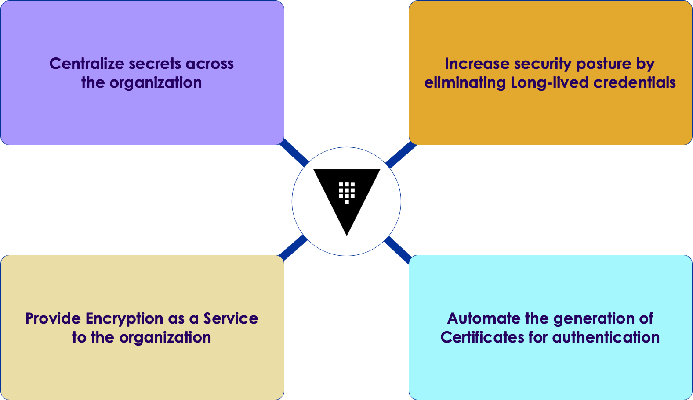
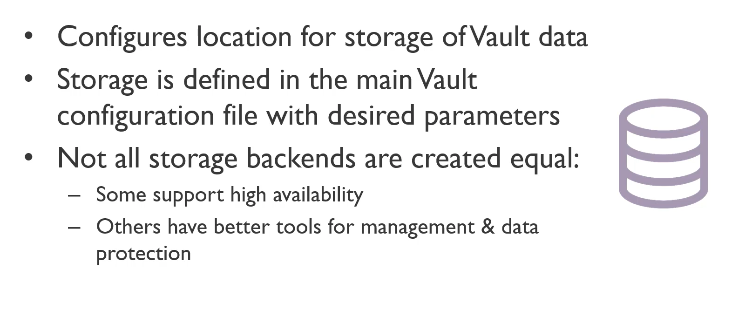

# Vault introduction
---

## Please meet Vault

* "Alice, please meet pudding"
* "Pudding, please meet Alice"
    * From *Alice in Wonderland*
    

 <!-- {"left" : 3.43, "top" : 2.94, "height" : 3.76, "width" : 3.38} -->

---

## HashiCorp history

* Vagrant was first
    * Jump into development environment
* Packer was next
    * Build machine images
* Serf and Consul
    * Meet the network challenges of distributed applications
* Terraform
    * Simple IaS
* Nomad
    * Containers with binaries, JARs, VMs
* Vault
    * Was not there

---

                            
## The need for Vault

* People need to store TLS certs, usernames, passwords, API keys, etc.
* In particular, HashiCorp customers entrusted these to HashiCorp
* Where do hackers go for big prizes?
    * Where the payout is great
* So HashiCorp was nervous
    * But existing approaches did not work
        * Insecure
        * Hard to automate
        * Too complex
        
---

## HashiCorp enterprise

 <!-- {"left" : 0.59, "top" : 2.89, "height" : 3.29, "width" : 9.07} -->

---

## Identity management

 <!-- {"left" : 0.81, "top" : 2.35, "height" : 4.37, "width" : 8.63} -->

---

## So, why Vault?         

* Allow access to systems and services
    * Only to authorized users and services
* And, it's not easy
* For example
    * Humans don't authenticate the same way as computers
    * Either humans suffer to computer designs are unnatural
    
---

## Vault place

 <!-- {"left" : 0.72, "top" : 2.01, "height" : 5.05, "width" : 8.81} -->

---

## Vault idea

* Let's look at Kerberos
    * It's good and popular
    * But complex and hard to integrate
    * Kerberos requires systems to integrate using GSS API
    
* Let's invert it!
    * Instead of requiring every system to speak a common language
    * Create a plugin for each system
        * Allow Vault to speak to the system via plugin
       
---
 
## Vault plugins

* Most RDMBS
* NoSQL
* Message queues
* Public cloud providers
* Active Directory
* LDAP
* More...

---

## Vault manages everyone
* That has an API and credentials
* Humans
    * Username/password
    * Single sign-on (SSO): Active Directory, Okta
* Applications
    * Certificates
    * Bearer tokens
    * Cloud vendors
    * Kubernetes
    * Nomad
    * CloudFoundary
    
---
    
## Benefits of Vault

 <!-- {"left" : 0.45, "top" : 2.36, "height" : 4.35, "width" : 9.34} -->

---

## Problems Vault solves

 <!-- {"left" : 1.02, "top" : 2.45, "height" : 4.75, "width" : 8.21} -->

---

## Authentication workflow

* As a result of above, Vault was designed to provide
    * Consistent workflow for authentication of clients
    * Consistent way to define authorization
    * Consistent API for getting credentials and performing operations
* As a result
    * Vault is easy to integrate
    * Plugins support a large ecosystem
    
---

## What is great about Kerberos?

* **Ephemeral access**
    * Never granting long-term credentials
    * Instead, giving only short-term access
    * That can be renewed as needed or even revoked
    * Think of all announcement of breaches due to stolen credentials that are valid for months or years
    * Amazon keys is one such example (and it did happen to us!)       
    
<!-- {"left" : 1.02, "top" : 4.33, "height" : 4.08, "width" : 8.21} -->

---

## But how?

* Question:
    * How to bring this idea to Vault
    * Keep in mind, most systems to integrate with have not similar concept
    
* Answer:
    * **"Dynamic secret"**
    * Secret engine 
        * Creates an entirely dynamic username and password
        * Or, API token depending on the system

---
        
## Dynamic Secret

* Credential that is only leased to the client
* Day 1
    * Application or user needs certain privileged credentials
* Day 2
    * Rotation of credentials
    * Revocation of access
    * Offboarding
* With dynamic secret
    * The credential is automatically destroyed at the end of its time to live
    * If the client stores a copy of the credentials -
    * The target system will still **reject** it
    
---

## Leases are short-lived

* Since leases are short-lived
* Clients are forced to periodically come back to Vault
    * Renew a lease, or
    * Fetch a new dynamic secret
* Advantages
    * Automate credential rotation
    * Elegant workflow for *Day 2* challenge    
    
---

## Building on Vault
* Common challenges
  * Encrypting customer data
  * Key management
* Answers
  * Secret engine (a.k.a. "transit" engine)
  * Holds encryption keys within Vault
  * Exposes API
    * Encryption
    * Decryption
    * Signing
    * Verifying transactions
    * More...
    * Leave key management and cryptography to Vault
  
---

## Vault today

* Keeps initial capabilities and design
* Supports a big number of authentication methods and secrets engines
* Richer automation capabilities
* Easier with CLI and web-based interface
* Ecosystem integrations
  * Configuration management systems
  * Application platforms
  * Low-level data management
  * Encryption solutions
* Key advantage: **simplicity** 
  * (compared to the problem it attempts to solve)  

---    

## What Vault provides

<!-- {"left" : 0.49, "top" : 1.65, "height" : 3.23, "width" : 9.27} -->

---

## Vault open-source vs Enterprise

<!-- {"left" : 1.02, "top" : 2.2, "height" : 5.23, "width" : 8.21} -->

---

## Vault components

<!-- {"left" : 0.56, "top" : 2.07, "height" : 4.11, "width" : 9.13} -->

---

## Vault storage backends

 <!-- {"left" : 0.39, "top" : 1.26, "height" : 4.01, "width" : 9.46} -->

---

## Vault secrets engines

 <!-- {"left" : 0.3, "top" : 1.26, "height" : 4.08, "width" : 9.64} -->

---

## Vault auth methods

 <!-- {"left" : 0.17, "top" : 1.26, "height" : 4.44, "width" : 9.9} -->

---

## Vault paths

 <!-- {"left" : 0.18, "top" : 1.26, "height" : 3.94, "width" : 9.89} -->

---

## Vault paths cont'd

 <!-- {"left" : 0.08, "top" : 1.26, "height" : 3.01, "width" : 10.09} -->

---

## Vault path examples

                       
 <!-- {"left" : 0.29, "top" : 1.85, "height" : 4.7, "width" : 9.68} -->

---

## HashiCorp high-level

 <!-- {"left" : 0.36, "top" : 2.14, "height" : 4.15, "width" : 9.53} -->

---

## Vault summary

 <!-- {"left" : 1.02, "top" : 2.42, "height" : 4.23, "width" : 8.21} -->

---

## Latest news: HCP Vault on AWS

* APR 07 2021
* HCP Vault is now generally available on AWS. 
  * HCP Vault gives you the power and security of HashiCorp Vault
  * We still need to know how to use it :)

---

## What's involved

* Create an account: 
  * First create a HashiCorp Cloud Platform account.
* Deploy a cluster
  * Next, select HCP Vault from the dashboard. We have a quickstart deployment guide that will walk you through the process of creating your HashiCorp Virtual Network (HVN) and a Vault cluster.
* Peer with AWS
  * Once you have deployed their HVN and cluster, the next step is to peer that network with your existing AWS environments.
  
---

## Vault on AWS pricing

 <!-- {"left" : 0.51, "top" : 2.34, "height" : 4.38, "width" : 9.23} -->

---