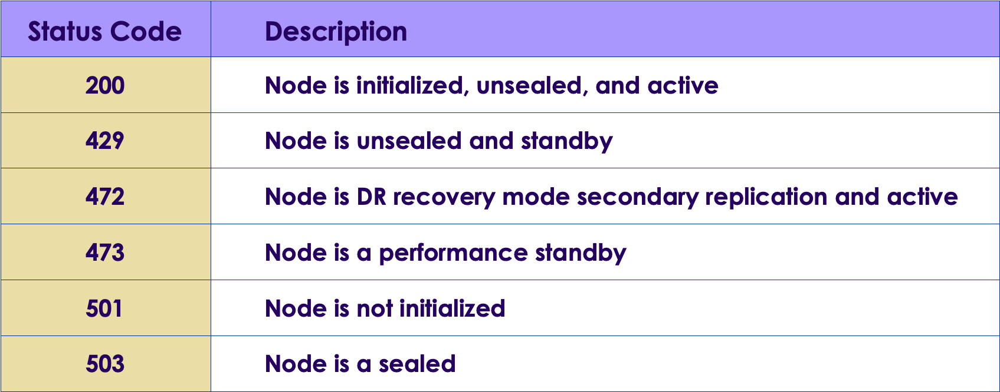
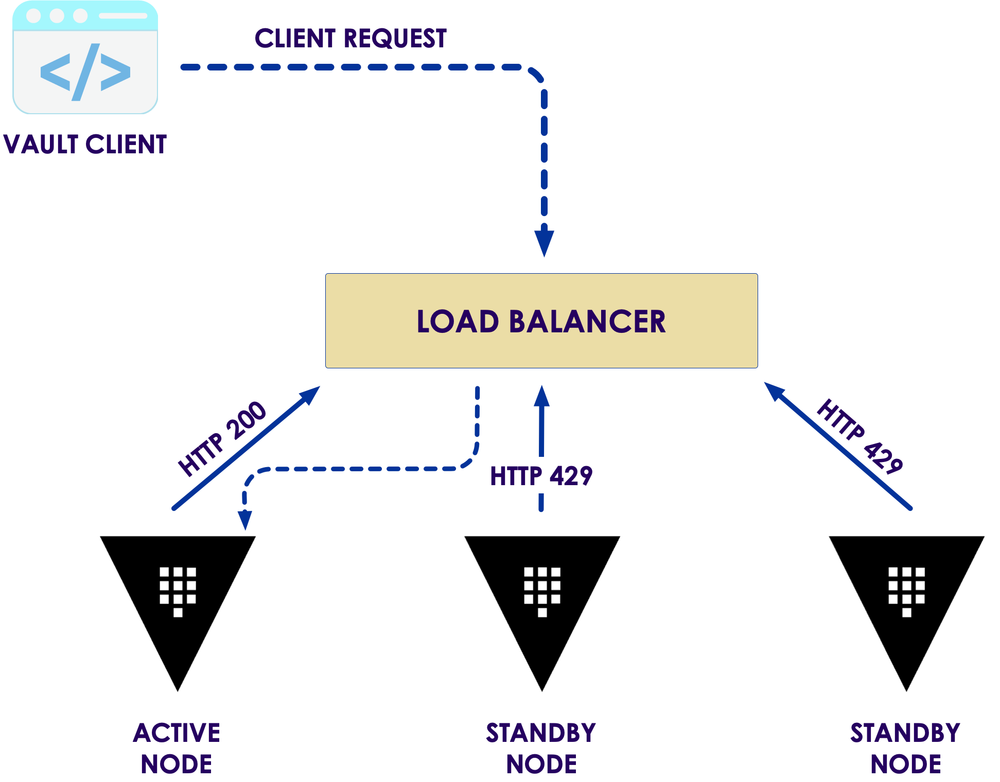

# Vault scalability

---
# Vault Deployment
---

## Vault design

* gathering business and technical requirements
* selecting where Vault will be provisioned
*  practical planning phase. 
* Proper design =>
  * accelerate the deployment and
  * adoption of Vault.

Notes:

This chapter is all about Vault design. From gathering business and technical requirements
to selecting where Vault will be provisioned, this chapter will describe a practical planning
phase. With a proper Vault design, organizations can accelerate the deployment and
adoption of Vault.

--- 

## What is needed

* Gathering Requirements
* Service Level Objectives and Indicators
* Designing the Vault Architecture
* Finalizing the Deployment Plan
* Choosing the Support Team

---

## Gathering Requirements

* Vault includes many features and integrations
* Planning a Vault deployment is not simple
  * conversations with internal teams such 
    * management,
    * development 
    *  security
    *  operations
    * automation
    *  even the network/security operations centers

Notes:
As with the introduction of any platform, organizations need to understand both the business
requirements and technical challenges that Vault is intended to solve. Vault includes many
features and integrations and can quickly become the focal point for services that
organizations depend on to run applications successfully and securely. Planning a Vault
deployment is not as simple as reading the technical documentation and following a step-
by-step guide; it requires conversations with internal teams such as management,
development, security, operations, automation, and even the network/security operations
centers. Defining these collections of both functional and non-functional requirements will
help ensure a successful project.

---

## Business Requirements

* Business requirements are critical
* Goals could include significant milestones such as
  * obtaining PCI-DSS certification
  * passing a HIPAA audit
  * internal goals 
    * improving security
    * consolidation of tools

Notes:

Requirement gathering happens in a layered approach, and each layer directly impacts the
one beneath it. Commonly, requirements gathering starts with "the big picture" and works its
way down to team-specific requirements. Therefore, the first functional requirements that
need to be understood are the general business requirements. Business requirements are
critical to understanding because they define the main objective of the overall project. Every
organization is different, and each business has requirements that must be met due to
events such as planning, the anticipation of new business or acquisitions, or the introduction
of new offerings to its customers. Goals could include significant milestones such as
obtaining PCI-DSS certification or passing a HIPAA audit down to internal goals such as
improving security or consolidation of tools. Regardless of the goal, each should be taken
into consideration when gathering requirements for a Vault implementation.

---

## Technical Requirements

* Once the business requirements are fully understood
* Dictated by existing or inbound technologies and services used by the business
  * cloud platforms
  * container scheduling
  * the workloads that interact with Vault
  
Notes:

Once the business requirements are fully understood, technical requirements are gathered
to help drive the design of the overall Vault implementation. As the name implies, technical
requirements are generally dictated by existing or inbound technologies and services used
by the business, such as cloud platforms, container scheduling, or the workloads that
interact with Vault. The technical requirements can also be driven by a service-level
agreement (SLA), regional or international availability, or established security policies.

---

## Tech requirements examples

* Vault must be highly available and provide an SLA of 99.99%
* Database secrets must not be valid for longer than 4 hours
* Vault services must be available for both on-premises and cloud-based workloads

Notes:

While gathering technical requirements, it is essential to discuss any constraints that may
affect the design and implementation. An example of a constraint may be "Vault must be
deployed in AWS," which may drastically change the Vault design instead of deploying Vault
on-premises. Constraints can come in many different forms, including budgetary, technical,
or time constraints.
In addition to constraints, risks must be identified and documented to ensure all parties
understand and agree to these risks. The potential increase in the cost of the underlying
infrastructure in a public cloud is an excellent example of a risk that should be considered. It
is essential to verify any assumptions made before or during the requirement gathering
process to ensure there are no "unknowns" when moving into the design phase.

---

## More requirements

* Which version of Vault will be implemented, Enterprise or Open-Source?
* Will Vault be deployed on a public cloud, on-premises, or both?
* Will Vault be provisioned using Terraform, scripts, or manually?
* Will Vault need to be highly available and deployed in a cluster?
* Does Vault need to be available in multiple data centers or cloud regions?
* What storage backend will Vault use to store its data?
* What secrets engines will be initially consumed?
* What performance and operational alerts should be configured?
* Are consistent instance sizes available across all cloud providers?

---

## Security Requirements

* Will access to the Vault nodes be permitted, or will nodes be treated as immutable?
* How will the underlying operating system be secured?
* What methods will be used to protect system memory where encryption keys are
stored?
* How are Vault audit logs ingested and correlated?
* What system account does the Vault service use?
* Are the Vault binaries, configuration files, and directories secured and audited?
* Is the storage backend secured from unauthorized access and modification?
* Is Vault secured by TLS?
* Who has access to unseal/recovery keys?
* Are TTLs minimized beyond a reasonable timeframe?
* Are Vault policies written to follow the principle of least privilege?

Notes:

Beyond the business and technical requirements, other requirements should be considered
and identified for the design. Since Vault is a security product, security requirements must
also be identified to ensure that the design not only follows the business' standards but may
include extra precautions due to the confidential data stored and managed by Vault. These
29may include additional techniques such as environmental hardening, operating system
hardening, and following best practices for Vault configuration and operations. All these
combined helps provide a defense-in-depth approach when designing and implementing
Vault in an environment.
Security requirements that might be gathered may include:

---

## End-User Requirements

* How will users or applications authenticate to Vault?
* What access is required within Vault once authenticated?
* Can applications be directed to performance standbys for read-only access?
* Does network and security infrastructure permit access to Vault from clients?
* Which secrets engines are required?
* What are the expectations around availability? How is degradation defined?
* Are there features or components not currently in place that may impact future Vault
needs?
  
Notes:

* It is essential to consider non-functional requirements as well. Often these can be
determined by interviewing or participation of the end-users who will use Vault. These end-
users could be various business units throughout the organization, DevOps teams who
manage the CI/CD pipelines to automate application development or machine-to-machine
authentication within an organization's application footprint. All these end-users are
ultimately the Vault service consumers, and without understanding how these end-users will
interact with Vault, it is impossible to run a thriving Vault service.
* When gathering requirements from end-users, it might help to build a Service Level
  Requirements (SLR) template that teams can fill out before onboarding to Vault. The SLR
  helps the onboarding team consider how they will integrate with Vault but also helps the
  support team to understand the needs of each consuming team better.
  
---

## Requirements Gathering Process

* workshop-type approach
* collaborative effort between management, development, security, operations, automation, and network teams
* Input in business, technical, security, and end-user requirements

Notes:

* In many organizations, requirements gathering can be an unnecessarily complicated
process due to either the organizational structure or the number of participants wishing to
voice an opinion. To minimize conflicts and increase efficiency, a workshop-type approach
is generally recommended to streamline the requirements gathering process and design the
Vault architecture. This Vault design workshop should be a collaborative effort between
management, development, security, operations, automation, and network teams. If it is not
feasible to include all parties in the workshop, representatives from each team can be
included in the workshop.
* Often, the workshop's participating members are defined as a
virtual team that will see the project from the beginning to end. These
virtual teams are created in place of a full-time team, as most
participants still have day-to-day responsibilities. Members of this team
frequently become part of the support team after the project is
completed.
* During the workshop, participants should provide input in determining the business,
technical, security, and end-user requirements in which the Vault solution and architecture
should meet. These critical decisions should be well documented and shared with all
involved parties within the organization. After requirements are agreed upon and
documented, the workshop should shift into the design phase. In this phase, the Vault
31architecture and related services are designed to meet the requirements. This phase likely
includes whiteboarding, discussions, and documenting decisions based upon HashiCorp
best practices, available technology, internal capabilities, and documented policies and
procedures. Any unanswered (parking lot) items should be documented, and action items
should be assigned to the responsible parties with expected dates for follow-up.
Note: In almost all cases, there will be an aspect of education during
the workshop to ensure all parties understand how Vault works, what
the Vault platform can do, and how Vault is deployed and
operationalized. Providing some level of education allows all
participating parties to help make educated decisions.
* After the design has been agreed upon, it should be well documented and shared with all
parties. Not only does this encourage open communication and collaboration among teams,
it also assists in solving disputes over agreed-upon service levels, requirements, and design
aspects. The documentation can also serve as a reference both during and after the Vault
architecture build-out. Service teams can reference the document as they develop
Terraform configuration files or automation scripts. New IT employees can reference the
documentation to understand why Vault is used in the organization, how it is deployed, and
where to seek additional information.

---

## Determining Service-Level Objectives

* Availability - Vault can respond to a client request within a given timeframe
* Throughput - Vault can handle the number of client requests within a given
timeframe
* Replication - Vault is replicating data between clusters at an acceptable rate
* Recoverability - Vault data can be recovered in the event of a failure that meets or
exceeds the organization's RTO
* Response Time – Vault can respond to requests within a specific timeframe, such
as 20ms.

Notes:

To ensure the Vault service meets and exceeds its SLA, service-level objectives (SLOs)
must be established to provide indisputable and measurable characteristics. These
measurements may include the availability, performance, and throughput available to
integrated applications when connecting to Vault. For example, Vault's SLO may indicate
that Vault has higher than a 99.99% uptime because many of the applications connecting to
Vault have a similar SLO. Using a service-level indicator (SLI), the historical uptime
statistics can be measured and reported on to ensure that they meet or exceed the SLO for
availability.

---

# Designing the Vault Architecture

* Fault Tolerance
* Vault Clustering

Notes:

One of the benefits of Vault is its flexibility to support a wide variety of failure scenarios. For
example, Vault can service clients using a single node deployment or be deployed across
multiple nodes to provide redundancy in the event of a failure. The data obtained in the
requirements gathering session should determine the level of fault tolerance needed in an
environment. Often, these decisions affect both the number of Vault nodes and the location
where they are provisioned.

Multiple Vault nodes configured to use the same storage backend automatically form a
cluster for high availability, assuming the storage backend supports it. Nodes within the
cluster are designated as either Active or Standby nodes. The first Vault node that grabs a
lock in the configured storage backend becomes the active node. All other nodes in the
cluster are designated as standby nodes. If the active node fails or becomes unavailable, a
standby node within the cluster is promoted to replace the active node through a leader
election process.

---

## Scalability

<!-- {"left" : 0.64, "top" : 2.54, "height" : 4.56, "width" : 8.97} -->

Notes:

Vault clustering is available in both the OSS and Enterprise version of Vault. In a traditional
Vault cluster running OSS, only the active node services client requests, and all standby
nodes forward or redirect client requests to the active node. While this type of architecture
provides high availability within the cluster, it does not increase scalability, meaning that
more standby nodes do not improve the performance of a Vault cluster. In a Vault
Enterprise cluster, the standby nodes in a cluster can be used as Performance Standby
nodes, which can service read-only requests for clients. Performance standby nodes
continue to forward all write requests to the active node in the cluster. Regardless of the
version, there is always one active node in a cluster

---

## Accessing the Vault Service

<!-- {"left" : 0.66, "top" : 2.18, "height" : 3.51, "width" : 8.93} -->

Notes:

Many customers will front-end a Vault cluster with a load balancer to target the cluster's
active node. Providing a front-end load balancer for a Vault cluster allows a reference with a
'friendly' DNS name, simplifying access to the cluster. This configuration is generally how
load balancers are used in a multi-node environment.
In Vault's case, however, load balancers are used to provide high availability to the Vault
service and not distribute requests across nodes. On the backend of the load balancer,
health checks are used to determine the active node. Information on individual nodes can
be obtained using Vault's dedicated health endpoint [/sys/health]. Each node responds with
an HTTP status code that corresponds with its status and its node type within the cluster. As
an example, a node that is initialized, unsealed, and is the active node returns an HTTP
status code of 200. If a node is unsealed but a standby node, it returns a status code of 429.
The dedicated health endpoint has multiple default status codes

---

## Vault cluster behind a load balancer

 <!-- {"left" : 1.32, "top" : 1.84, "height" : 5.96, "width" : 7.62} -->

Notes:

As an example, Figure 2-2 represents a Vault cluster behind a load balancer. While the
standby nodes return an HTTP status code of 429, the active node returns a 200 and is the
Vault node to which all client requests are forwarded

---

## Consul Service Discovery

* alternative to using a load balancer
* opt to use HashiCorp Consul's service discovery
* Each Vault node would be configured to register the Vault service with Consul

Notes:

As an alternative to using a load balancer, organizations can opt to use HashiCorp Consul's
service discovery feature to target Vault using DNS and service registration. Each Vault
node would be configured to register the Vault service with Consul, and integrated health
checks would allow Consul to determine each node's status and health. Consul
automatically creates service registrations for both the active node as well as standby
nodes. Once Vault nodes are registered, clients can access the service using the DNS
records in which Consul is the authoritative server for responses to DNS queries. As an
example, the Vault service could be accessed by sending a request to
active.vault.service.consul, assuming the default Consul configurations are used.
Many organizations opt to go this route if service discovery or service mesh technologies
are already in use, or they are looking for the opportunity to deploy such a solution. Keep in
mind, though, that the Consul cluster serving as the storage backend for Vault should not be
used for other Consul services, such as service discovery. A separate cluster should be
provisioned to manage these services.

---

## Consul Storage Backend

<!-- {"left" : 0.69, "top" : 2.42, "height" : 3.99, "width" : 8.88} -->

Notes:

* HashiCorp also supports Consul as a storage backend for Vault. This storage backend is
reliant on a separate HashiCorp Consul cluster, in which Vault can store persistent data
using Consul's key/value store. The Consul cluster comprises of multiple nodes running the
Consul agent in server mode and is frequently provisioned alongside the Vault nodes to
minimize latency for communication.
Consul uses two main protocols to function: a gossip protocol and a consensus protocol:

* Gossip Protocol: Consul uses a gossip protocol based on Serf to manage
membership and communication within the cluster. Consul uses two different gossip
pools: LAN connectivity (local) and WAN connectivity (cross data center requests).
For a Vault implementation, only LAN is used for the storage backend.

* Consensus Protocol: the consensus protocol is based on Raft and is responsible
for managing the quorum, log entries, and cluster leadership.
A node in a Consul cluster is either a leader or a follower. When Consul is started, each
node starts as a follower, but servers work together to elect a leader using the Raft protocol.
The leader is responsible for processing all new transactions. Once transactions are
committed, the leader is responsible for replicating that data to all other server nodes in the
cluster.

---

## Configuring Vault components

* Auth Methods
* Secrets Engines
* Vault Policies
* Audit Devices

---

## Managing the Vault service

* Vault Service Maintenance
* Scaling and Optimizing Vault
* Replication and Disaster Recovery
* Common Issues and Solutions
* Common Migration and Onboarding Patterns

---

## Extending and Integrating Vault

* Integrating with Kubernetes
* Consul for Service Discovery
* Terraform Integration
* Coding for Reliability

