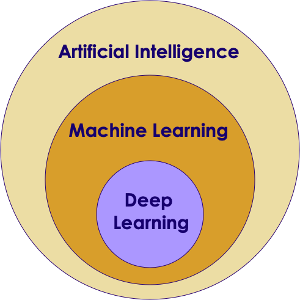
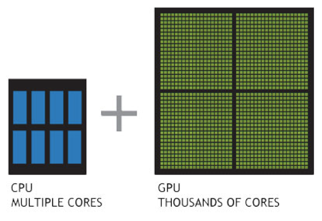
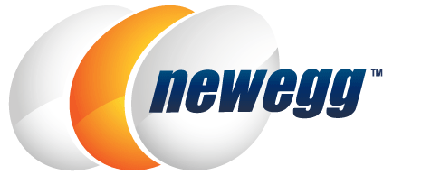

# Learning Machine Learning With Google CoLab

---

## Welcome :  Learning Machine Learning With Google CoLab

-  All the links from webinar are here :  
   http://bit.ly/2FctmXZ

- We will soon send an email with slides + recording + all the other info

- Survey Please tell me about your background

- Q&A : Submit your questions (look for Q&A tab on your Zoom client)

---

## Hello !


### http://bit.ly/2FctmXZ


- I am **Sujee Maniyam**

- Founder and principal trainer @ [Elephant Scale](https://elephantscale.com)

- Background : Big Data, Data Science

```json
{ "email" : "sujee@elephantscale.com",
  "Github" : "https://github.com/sujee",
  "LinkedIn" : "https://www.linkedin.com/in/sujeemaniyam"
}
```


---

## Objective

- Some background on AI
- How do you go about learning AI using Google's Colab environment

- Poll : Your background

---

# Part 1 : AI Intro

---

## AI is a Huge Disruptor / Enabler


---

## AI Growing at a Phenomenal Rate


Notes:

https://mapr.com/blog/ai-ml-2018-and-beyond/


---

## Question for Class: Are We in a AI Hype Cycle?


Notes:

---

## Case for AI


Notes:

Image credit: coursera

---
## Informal Definition of Machine Learning


 "**The field of study that gives computers the ability to learn without being explicitly programmed.**"  
 -- Arthur Samuel

 * Example: Self-driving cars

     - Tell the car the rules, or

     - Let it record the scenery and your reactions

     - Let it predict the next reaction


Notes:


---

## Spam Detection - Traditional (Rule Based) Approach


 * Computers follow explicit instructions (code)

 * Can be tens of millions code lines but still explicit instructions, something like this:

```java
// explicitly coding the rules

if (email.from_ip.one_of("ip1", "ip2", "ip3")) {
	result = "no-spam"
}
else if ( email.text.contains ("free loans", "cheap degrees"))
{
	result = "spam"
}

```

Notes:


---

## Spam Detection - AI Approach


 * Show the algorithm with spam and non-spam emails

 * Algorithm 'learns' which attributes are indicative of spam

 * Then algorithm predicts spam/no-spam on new email


Notes:


---

## How is AI Different from Rule Based Systems


 * Rule based systems are static

     - They are programmed in

     - They don't learn from data

 * AI can learn from data

     - It gets better every day with more data it sees


Notes:


---

# Understanding AI Vocabulary

Notes:

Primer is pronounced `primmer`

---

## AI / Machine Learning / Deep Learning



 *  **Artificial Intelligence (AI):** Broader concept of "making machines smart"

 *  **Machine Learning:** Current application of AI that machines learn from data using mathematical, statistical models

 *  **Deep Learning: (Hot!)** Using Neural Networks to solve some hard problems


Notes:


---

## AI / Machine Learning / Deep Learning


Notes:


---

## AI Vocabulary


 *  **Training**

     - Feeding data to an algorithm to create a model

     - Computationally expensive

 *  **Prediction / Inference**

     - Created model answering questions (very fast)

     - "is this transaction fraud / not-fraud"

     - "What are the recommended movies for this user"


Notes:


---

## AI Vocabulary


 *  **(Artificial) Neural Networks**

     - Layers of parallel processing elements, working together to solve very complex tasks

     - Inspired by neurons from human brain

     - Used in Deep Learning

     - (More on this later)

Notes:


---


## AI Success Stories

 * Image recognition

 * Translation

 * Self driving cars


Notes:

Image credit : Wikimedia: CCZero license


---

## AI Success Story : Image Recognition: Cats & Dogs


Notes:

All images are used with  'creative common zero-CCZero' permissions  from Pexels.com

---

## Kaggle Competition

 * Recognize dogs & cats

 * Given 25,000 sample images to train

 * Then tested on 15,000 test images

 * Winning algorithm correctly classified 98.9% time !

 * https://www.kaggle.com/c/dogs-vs-cats


Notes:

All images are used with 'creative common zero -  cc-zero' permissions from  Pexels.com


---

## A Glimpse of AI History

 * Sixties

     - Commercial computers & mainframes

     - Computers play chess

 * Eighties

     - Artificial intelligence (AI) get  **'oversold** ', doesn't live up to the promise and gets a bad rap

 * 21st century

     - Big Data changes it all

Notes:


---

## The Great AI Revival - 21st century (2010 on)


 * AI is going through a resurgence now

 *  **'Big Data** ' - now we have so much data to train our models

 *  **'Big Data ecosystem** ' - excellent big data platforms (Hadoop, Spark, NoSQL) are available as open source

 *  **'Big Compute** ' - **cloud**  platforms significantly lowered the barrier to massive compute power

     - $1 rents you 16 core + 128 G + 10 Gigabit machine for 1 hr on AWS!
     - So running a 100 node cluster for 5 hrs --> $500

 *  **Advances in hardware** - CPU / GPU / TPU

Notes:

https://www.nytimes.com/2016/12/14/magazine/the-great-ai-awakening.html


---

## Hardware - GPU


 * Recently GPUs - Graphics Processing Units - have become popular (especially in Deep Learning)

 * GPU cores are good at compute intensive calculations (math, matrix operations)

 * Each GPU core is capable of executing small set instructions, but there are 1000s of core per GPU

     - Running in parallel




Notes:


---

## Latest GPU Technology - Nvidia

 * Tesla V100 GPU

     - Has 5,120 cores!

 * Computation @ 120 Tera Flops!

 * Bandwidth using NVLink: 300 GB/s

 * [Video](https://www.youtube.com/watch?v=3aAEKRDhrj8)


Notes:

https://www.youtube.com/watch?v=3aAEKRDhrj8


---


## Hardware - Modern CPU


 * Modern Intel Xeon CPUs (E5 or later) have vectorized linear algebra

     - Properly optimized, approaches speed of GPUs

     - And offers faster I/O performance for Big Data.

 * Intel Math Kernel Library - highly optimized, threaded, and vectorized math functions that maximize performance on each processor family


Notes:


---

## Hardware - TPU (Tensor Processing Unit)


 * A [Tensor processing unit (TPU)](https://en.wikipedia.org/wiki/Tensor_processing_unit) is an AI accelerator application-specific integrated circuit (ASIC) developed by Google specifically for neural network machine learning

 * More capable the CPUs / GPUs in certain tasks

 * Designed for [Tensorflow](https://github.com/tensorflow/tensorflow)

 * Designed for high volume computes

     - A TPU can process 100 million photos a day

 * Available in Google Cloud platform

Notes:

https://en.wikipedia.org/wiki/Tensor_processing_unit
https://github.com/tensorflow/tensorflow


---

## Google TPU System in Data Center


Notes:

Image credit: NY Times: https://www.nytimes.com/2018/02/12/technology/google-artificial-intelligence-chips.html


---

## Incredible Growth of AI Power


Notes:


---

## Incredible Growth of AI Power


 * Since 2012, the amount of compute used in the largest AI training runs has been increasing exponentially with a 3.5 month-doubling time (by comparison, Moore's Law had an 18-month doubling period)Source: (https://blog.openai.com/ai-and-compute/)
 * Phases:
     - Before 2012: It was uncommon to use GPUs for ML, making any of the results in the graph difficult to achieve.
     - 2012 to 2014: Infrastructure to train on many GPUs was uncommon, so most results used 1-8 GPUs rated at 1-2 TFLOPS for a total of 0.001-0.1 pfs-days.
     - 2014 to 2016: Large-scale results used 10-100 GPUs rated at 5-10 TFLOPS, resulting in 0.1-10 pfs-days. Diminishing returns on data parallelism meant that larger training runs had limited value.
     - 2016 to 2017: Approaches that allow greater algorithmic parallelism such as huge batch sizes, architecture search, and expert iteration, along with specialized hardware such as TPU's and faster interconnects, have greatly increased these limits, at least for some applications.

Notes:

https://blog.openai.com/ai-and-compute/


---

## Video - CPU vs GPU Demonstration


[Video](https://www.youtube.com/watch?v=-P28LKWTzrI)

Notes:

https://www.youtube.com/watch?v=-P28LKWTzrI


---

## Video - Advances in Hardware - Nvidia


[Nvidia Self Driving DL](https://www.youtube.com/watch?v=0rc4RqYLtEU)


Notes:

* Nvidia Self Driving DL - https://www.youtube.com/watch?v=0rc4RqYLtEU


---

## Video - Advances in Hardware - Nvidia


 * [Nvidia GPU, Audi autonomous driving](https://www.youtube.com/watch?v=DjAJnQoNdMA)
    - Cool comparison of learning rate of Brain vs. CPU vs. GPU around 50 second mark


Notes:

---

## Video - Advances in Hardware


[Google TPU](https://www.youtube.com/watch?v=UsDhVx6cOrw) (up to 5 min mark)

Notes:

https://www.youtube.com/watch?v=UsDhVx6cOrw


---

## AI History


 * [Video](https://www.youtube.com/watch?v=056v4OxKwlI)

Notes:

https://www.youtube.com/watch?v=056v4OxKwlI

---

# Part 2 : Hands on / Demos

---

## Getting Started With Machine Learning

- Step 1: Setup your laptop with Python libraries

- Step 2: Learn Python

- Step 3: Learn and experiment with Machine Learning libraries

- Most of our laptops have pretty decent CPUs
    - how about if we want to experiment with GPU / TPU ?

---

## Choice 1 : Building Your Own


---

## Choice 2 : Buy

- [NewEgg.com](https://newegg.com)
- [Amazon](https://amazon.com)
- [Lambda Labs](https://lambdalabs.com)





---

## Buying

Lambda Labs


---

## Buying


Amazon


---

## Choice 3 :  Cloud

- Poll : Cloud Env

| AWS                                                                     | Azure                                                                                   | Google Cloud                                        |
|-------------------------------------------------------------------------|-----------------------------------------------------------------------------------------|-----------------------------------------------------|
| P2 series : Nvidia K80 (pricing from $0.9 / hr)                         | ND series : NVIDIA Tesla P40 GPUs (starting at $0.9 / hr)                               | NVIDIA® Tesla® P100 (starting from $1.46 / gpu hr)  |
| P3 series : Nvidia V100 (pricing from $3 / hr)                          | NC series : NVIDIA's Tesla V100 GPUs (starting at $3 / hr)                              |  NVIDIA® Tesla® V100 (starting at $2.48 per GPU hr) |
| [More Info](https://docs.aws.amazon.com/dlami/latest/devguide/gpu.html) | [More Info](https://azure.microsoft.com/en-us/pricing/details/virtual-machines/series/) | [More info](https://cloud.google.com/gpu/)          |


---

## Google Colab

> Colaboratory is a free Jupyter notebook environment that requires no setup and runs entirely in the cloud.
>   https://colab.research.google.com


- A research project from Google

- Zero setup!

- Can run on CPU / GPU / TPU

- Free !!

---

# Demos


---

## Demos

https://colab.research.google.com/

### Info : [bit.ly/2FctmXZ](http://bit.ly/2FctmXZ)

### Demo Notebooks
Available at : https://github.com/elephantscale/es-public/tree/master/colab-demo


---

## Demo 1 : Testing123

---
## Demo 2 : Simple Linear Regression

---

## Demo 3 : Detect Hardware

---

## Demo 4 : Cats and Dogs

---

## Thanks


---

## Thanks & Questions?

### http://bit.ly/2FctmXZ


- Let's answer some questions

- Interested in a FREE, machine learning class?  
Attend online, weekly, hands-on.  
Sign up here :  http://eepurl.com/gkScbf

```json
{ "contact email" : "hello@elephantscale.com",
  "web" : "https://elephantscale.com",
  "Github" : "https://github.com/elephantscale"
}
```


[ElephantScale.com](https://elephantscale.com)
